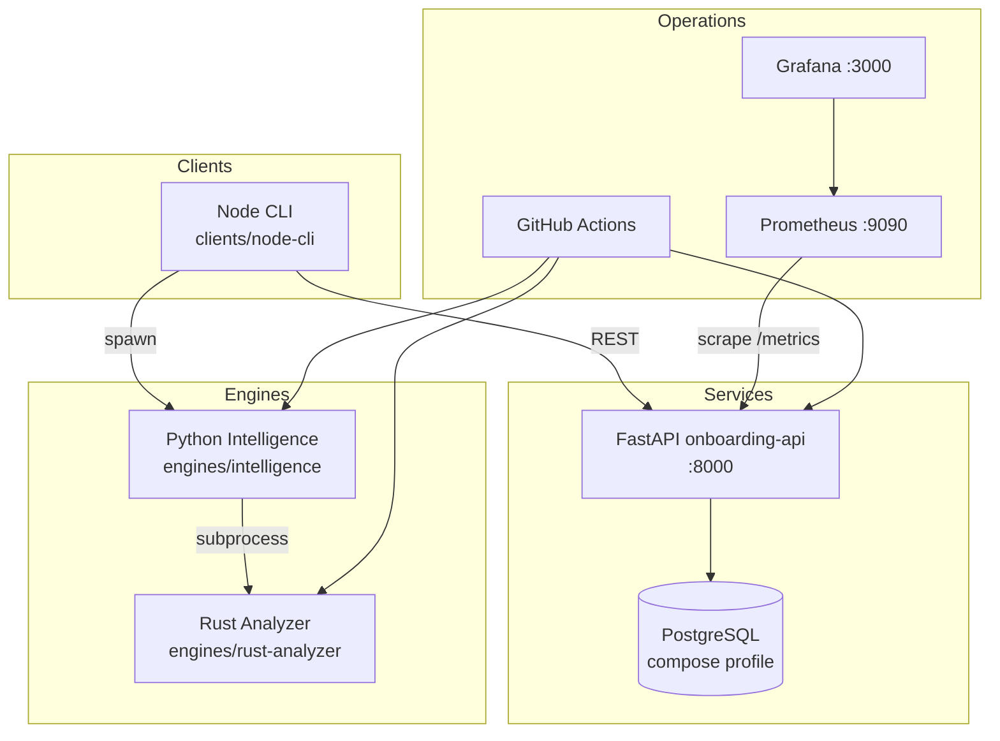

# Architecture Overview

**Consolidated reference** — detail in `docs/architecture/` (Phase 1, 8 files)

---

## System Context

AI-Powered **KYC & Onboarding** API plus **Repository Intelligence** platform in a phase-gated monorepo.

| Actor | Interface |
|-------|-----------|
| Operator / CLI | Node `kyc-cli` → FastAPI |
| Platform engineer | Docker Compose, Grafana, CI |
| Coding agent | Worktrees, verification files, evidence store |

---

## Container Diagram



---

## Layered API Architecture

```
HTTP Request
    → Router (app/routers/)
    → Service (app/services/)
    → Repository (app/repositories/)
    → SQLAlchemy Model (app/models/)
    → Database
```

**Rule:** Routers must not call repositories directly.

---

## Domain Model

5 entities: Customer, KycSubmission, PanRecord, BankRecord, RiskAssessment  
See [er-diagram.md](er-diagram.md)

---

## Intelligence Pipeline

1. Detect framework (FastAPI / Spring / Node)
2. Walk repository (`walker.py`)
3. Extract inventories (6 reports)
4. Trace flows → Mermaid sequences
5. Optional Rust enrichment (`rust_bridge`)

---

## Deployment Topology

| Environment | Mechanism | Evidence |
|-------------|-----------|----------|
| Local dev | venv + uvicorn | CONTRIBUTING.md |
| Container | Docker Compose | `infra/docker/docker-compose.yml` |
| K8s (scaffold) | Deployment YAML | `infra/kubernetes/` |
| IaC | **Not implemented** | `infra/terraform/README.md` |

---

## Cross-References

| Topic | Document |
|-------|----------|
| Full design | [docs/architecture/README.md](architecture/README.md) |
| API map | [api-map.md](api-map.md) |
| Flow trace | [flow-trace.md](flow-trace.md) |
| Sequence (KYC) | [sequence-diagram.md](sequence-diagram.md) |
| DevOps | [devops-validation.md](devops-validation.md) |
| Technology choices | [architecture/07-technology-rationale.md](architecture/07-technology-rationale.md) |
