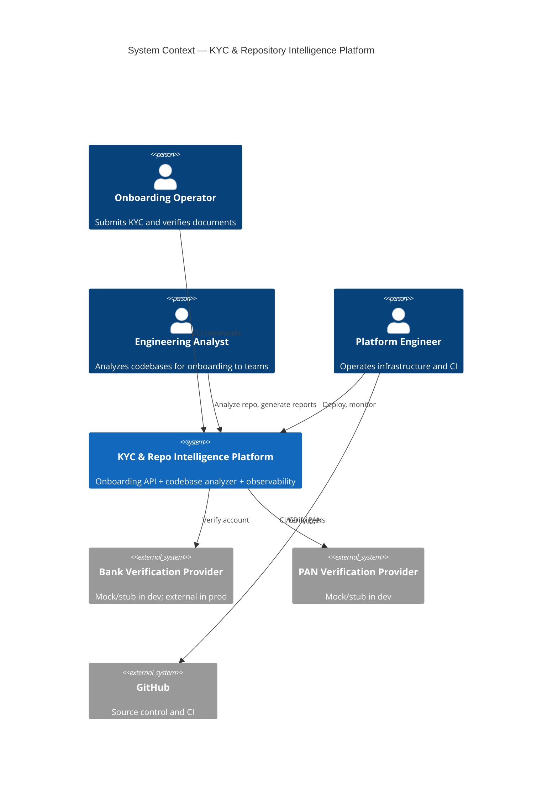
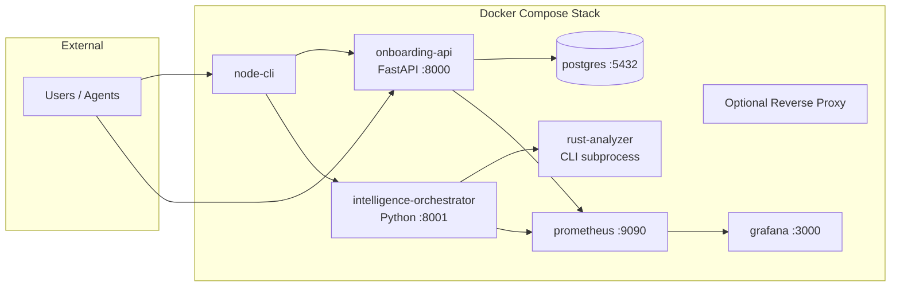
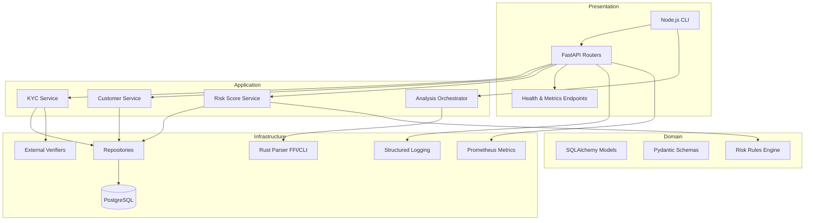
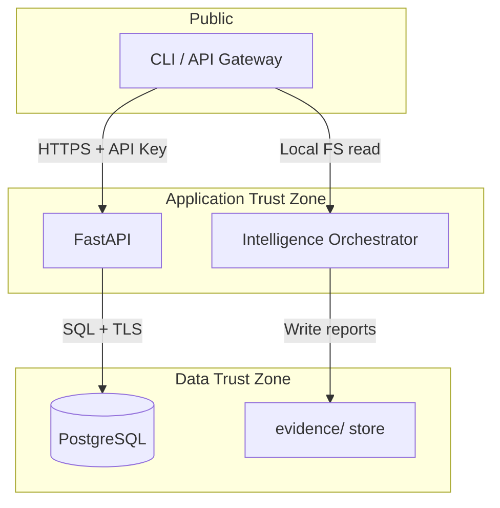

# High-Level Architecture

## 1. System Context (C4 Level 1)

The platform serves three actor groups:

| Actor | Goal | Interface |
|-------|------|-----------|
| **Onboarding Operator** | Create customers, submit KYC, verify PAN/bank | Node.js CLI → FastAPI |
| **Engineering Analyst** | Understand unfamiliar repos (APIs, flows, tests) | CLI / agent → Intelligence Engine |
| **Platform Engineer** | Deploy, observe, verify CI/CD and containers | Docker Compose, Grafana, GitHub Actions |

---

## 2. Container View (C4 Level 2)

---

## 3. Logical Architecture Layers

---

## 4. Deployment Topology

### Local Development

| Service | Port | Notes |
|---------|------|-------|
| FastAPI | 8000 | Hot reload via uvicorn |
| Intelligence API | 8001 | Optional HTTP wrapper for analyzer |
| PostgreSQL | 5432 | Persistent volume |
| Prometheus | 9090 | Scrapes `/metrics` |
| Grafana | 3000 | Pre-provisioned dashboard |

### Production Considerations (Future)

- Kubernetes with separate deployments per service
- Managed PostgreSQL (RDS/Cloud SQL)
- Secrets via vault; no credentials in compose files
- mTLS between services; API gateway for external traffic

---

## 5. Security Boundaries

| Control | Implementation |
|---------|----------------|
| Input validation | Pydantic schemas on all endpoints |
| PII handling | PAN/bank masked in logs; encrypted at rest (Phase 2+) |
| Analyzer sandbox | Read-only repo access; path traversal checks |
| Secrets | Environment variables; never committed |

---

## 6. Non-Functional Requirements

| NFR | Target | Verification |
|-----|--------|--------------|
| API latency (p95) | < 200ms excluding external verifiers | Prometheus histogram |
| Analyzer throughput | > 500 files/sec (Rust) | Benchmark in `evidence/test-results/` |
| Availability | 99.9% (single-node dev: best effort) | Health checks in compose |
| Test coverage | ≥ 80% on critical paths | Coverage reports Phase 7 |
| Documentation | Every endpoint in OpenAPI + architecture docs | Manual + agent review |

---

## 7. Risk Assessment

| Risk | Mitigation |
|------|------------|
| Monolith creep in FastAPI | Enforce service/repository layers; lint import boundaries |
| Rust/Python integration complexity | Start with CLI subprocess; optional FFI later |
| False flow traces | Uncertainty report with confidence per edge |
| PII in evidence store | Redact before writing reports; `.gitignore` for sensitive runs |

---

## 8. Evaluation Mapping (Phase 1)

| Dimension | How This Document Satisfies |
|-----------|----------------------------|
| D3 | C4 diagrams, deployment table, traceability |
| D4 | Security boundaries, NFR, risk sections |
| B6 | KYC domain context defined |
| I1–I6 | Container view shows all stack components |
