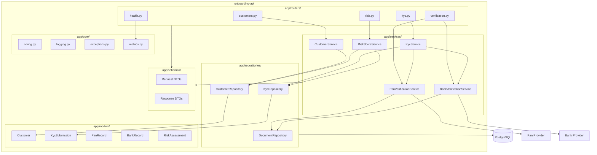
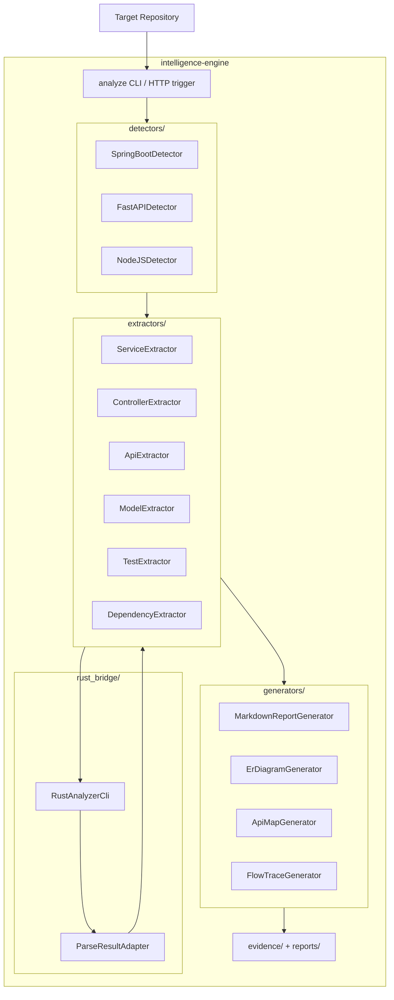
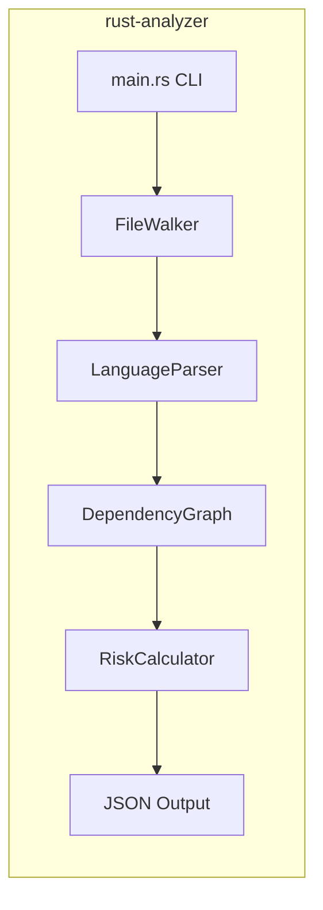
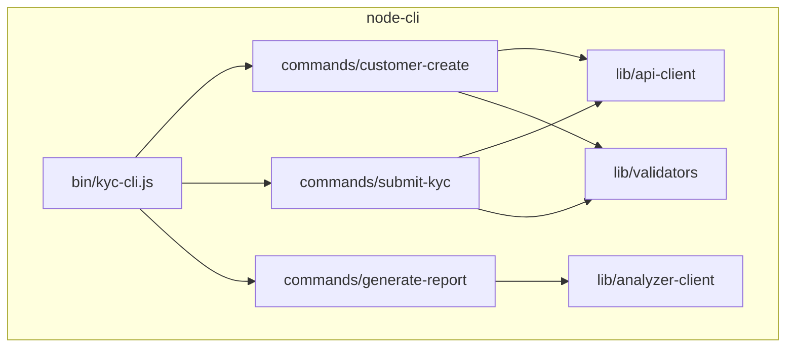
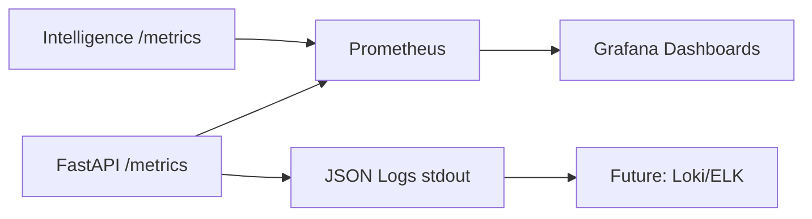
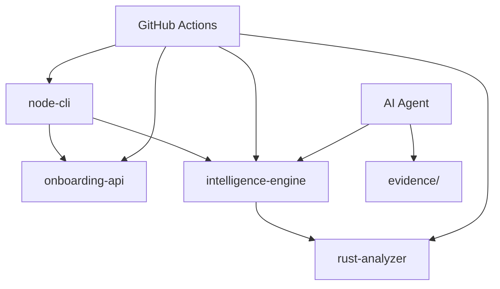

# Component Diagram

## 1. FastAPI Onboarding Service

### Component Responsibilities

| Component | Responsibility | Depends On |
|-----------|----------------|------------|
| `routers/*` | HTTP binding, status codes, OpenAPI tags | services, schemas |
| `services/*` | Business rules, orchestration, transaction boundaries | repositories, external verifiers |
| `repositories/*` | CRUD, queries, persistence mapping | models, SQLAlchemy session |
| `models/*` | ORM entities, relationships | SQLAlchemy |
| `schemas/*` | Request/response validation | Pydantic |
| `core/config` | Settings from env (pydantic-settings) | — |
| `core/logging` | JSON structured logs (structlog) | — |
| `core/metrics` | Prometheus counters/histograms | prometheus_client |
| `core/exceptions` | Domain errors → HTTP mapping | — |

---

## 2. Repository Intelligence Engine

### Detector Strategy

| Framework | Detection Signals | Extractors Used |
|-----------|-------------------|-----------------|
| **Spring Boot** | `@RestController`, `@Service`, `@Repository`, `pom.xml`/`build.gradle` | Controller, Service, Model (JPA), Test (JUnit) |
| **FastAPI** | `@router`, `APIRouter`, `services/`, `models/` | API, Service, Model, Test (pytest) |
| **Node.js** | `express.Router`, `routes/`, `package.json` | API, Service, Test (jest/vitest) |

---

## 3. Rust Analysis Engine

| Module | Purpose |
|--------|---------|
| `file_walker` | Ignore `.git`, `node_modules`; respect `.analyzerignore` |
| `language_parser` | Tree-sitter / regex hybrid per language |
| `dependency_graph` | Import/require edges between files |
| `risk_calculator` | Heuristic score from complexity, test ratio, secrets patterns |

---

## 4. Node.js CLI Client

---

## 5. Observability Components

| Metric | Type | Labels |
|--------|------|--------|
| `http_requests_total` | Counter | method, path, status |
| `http_request_duration_seconds` | Histogram | method, path |
| `kyc_submissions_total` | Counter | status |
| `risk_score_histogram` | Histogram | band (low/medium/high) |
| `analyzer_runs_total` | Counter | framework, status |
| `analyzer_duration_seconds` | Histogram | framework |

---

## 6. Cross-Component Dependencies

---

## 7. Evaluation Mapping

| Dimension | Coverage |
|-----------|----------|
| B1–B5 | Intelligence engine component breakdown |
| B6 | FastAPI KYC component model |
| I1–I3 | Per-service component diagrams |
| I6 | Observability component metrics |
| D3 | Component → responsibility traceability |
| D6 | Layered architecture conventions |
