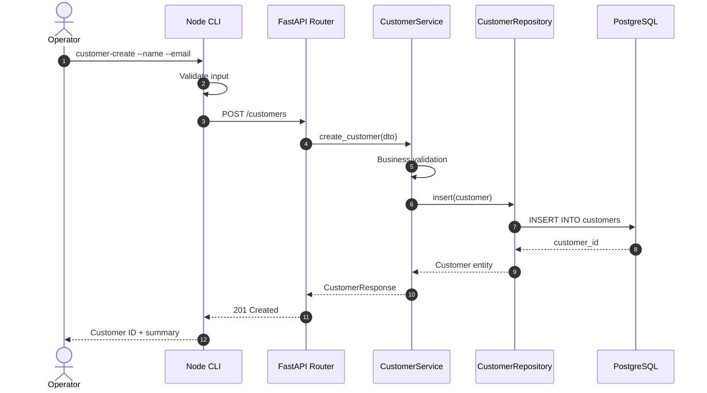
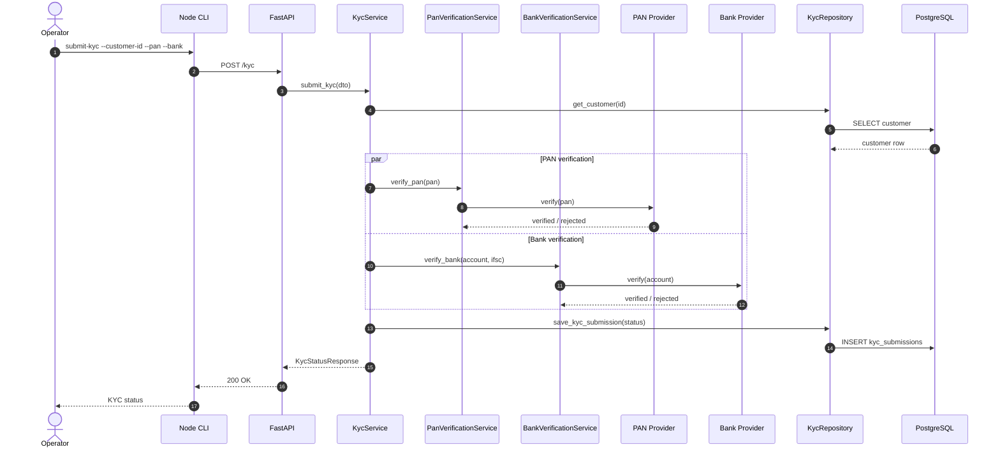
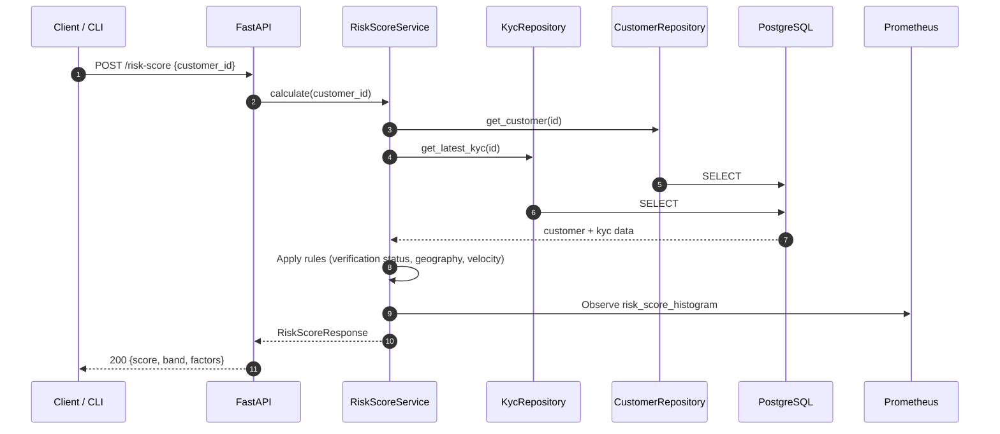
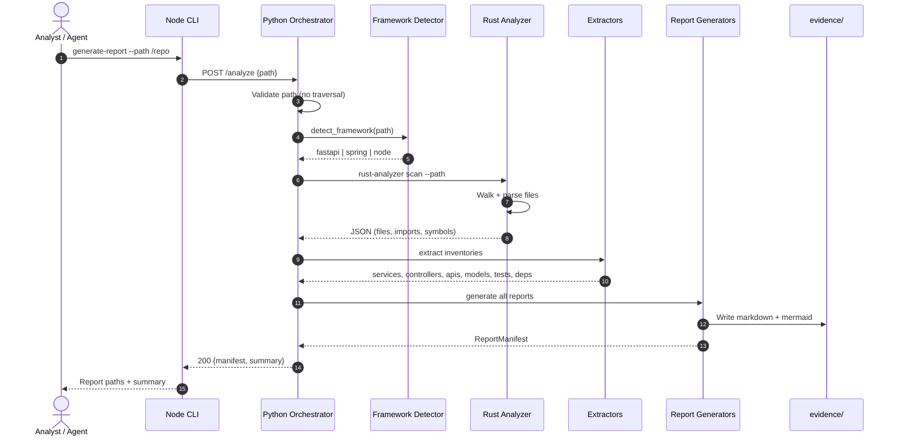
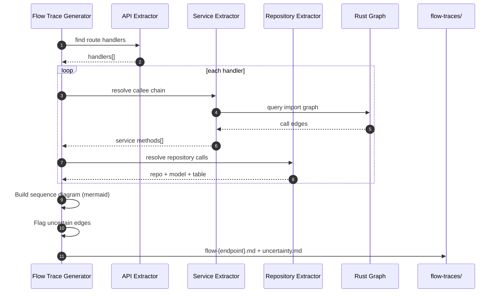
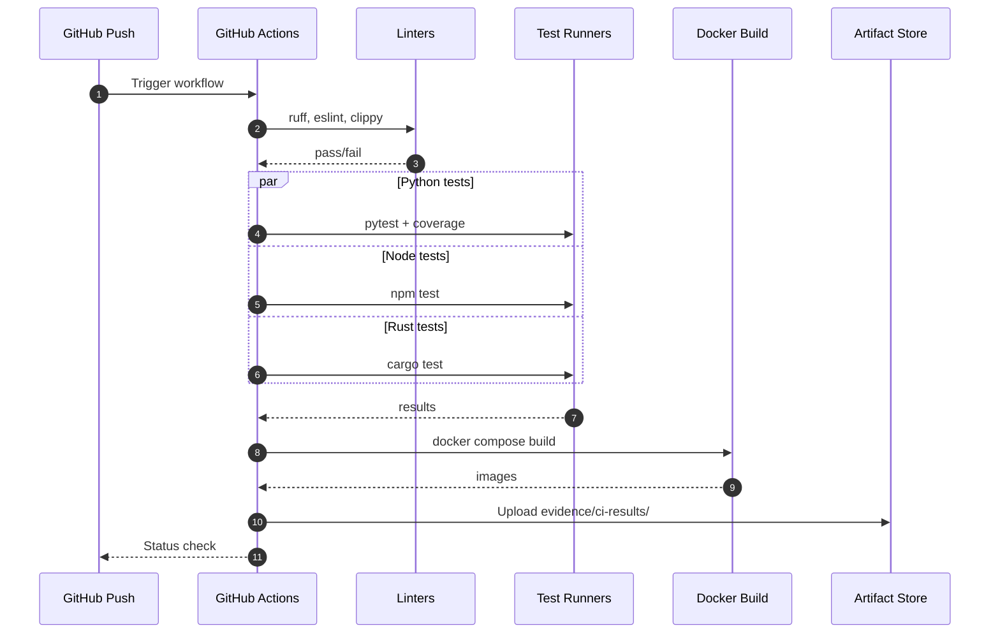
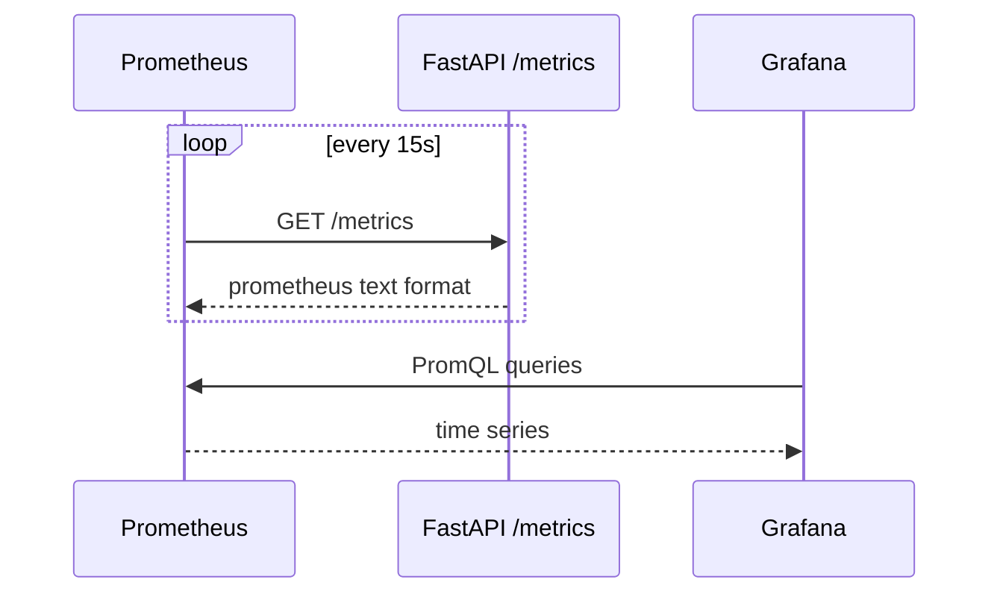

# Sequence Diagrams

## 1. Customer Onboarding (Happy Path)

---

## 2. KYC Submission with PAN & Bank Verification

---

## 3. Risk Score Calculation

---

## 4. Repository Analysis (Intelligence Engine)

---

## 5. End-to-End Flow Trace Generation

---

## 6. CI/CD Pipeline Run

---

## 7. Health & Metrics Scrape

---

## 8. API Endpoint Summary (Traceability)

| Endpoint | Sequence Diagram | Primary Service |
|----------|------------------|-----------------|
| `POST /customers` | §1 Customer Onboarding | CustomerService |
| `POST /kyc` | §2 KYC Submission | KycService |
| `POST /pan-verify` | §2 (PAN branch) | PanVerificationService |
| `POST /bank-verify` | §2 (Bank branch) | BankVerificationService |
| `POST /risk-score` | §3 Risk Score | RiskScoreService |
| `GET /customer/{id}` | §1 (read variant) | CustomerService |
| `GET /kyc-status/{id}` | §2 (read variant) | KycService |
| `GET /health` | §7 | Health router |
| `GET /metrics` | §7 | Metrics middleware |

---

## 9. Evaluation Mapping

| Dimension | Coverage |
|-----------|----------|
| B4 | §5 Flow trace generation sequence |
| B6 | §1–§3 KYC domain flows |
| I1 | FastAPI sequences |
| I5 | §6 CI/CD sequence |
| I6 | §7 Metrics scrape |
| D3 | Endpoint → diagram traceability table |
