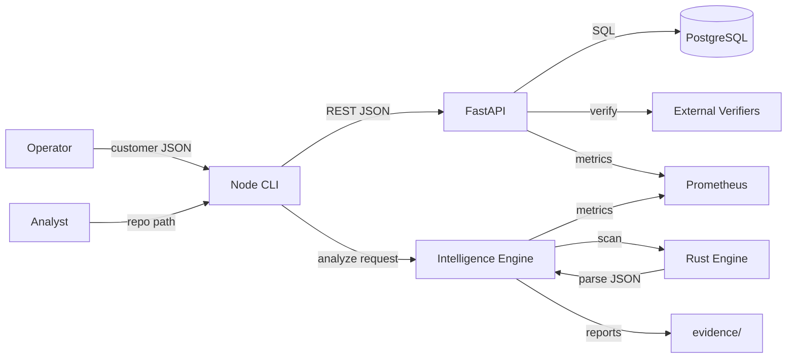
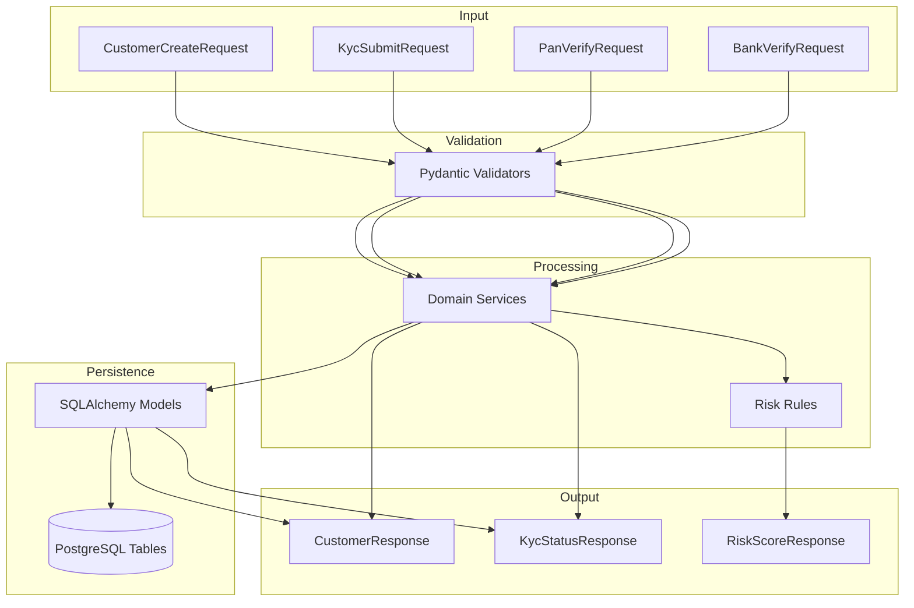
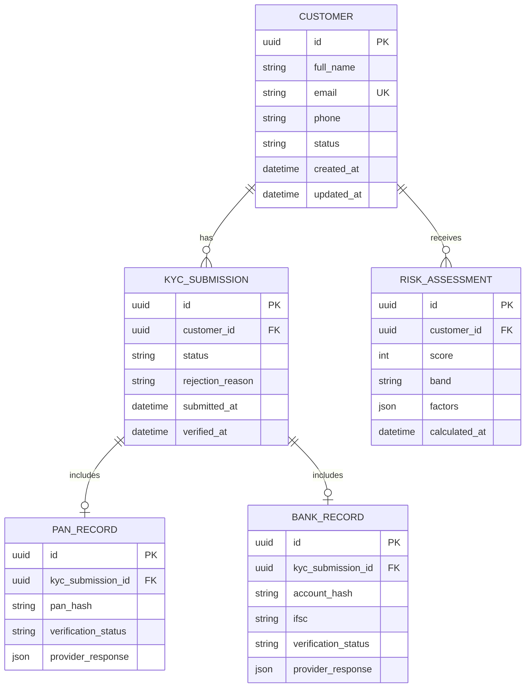
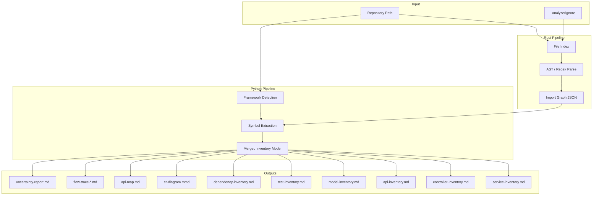
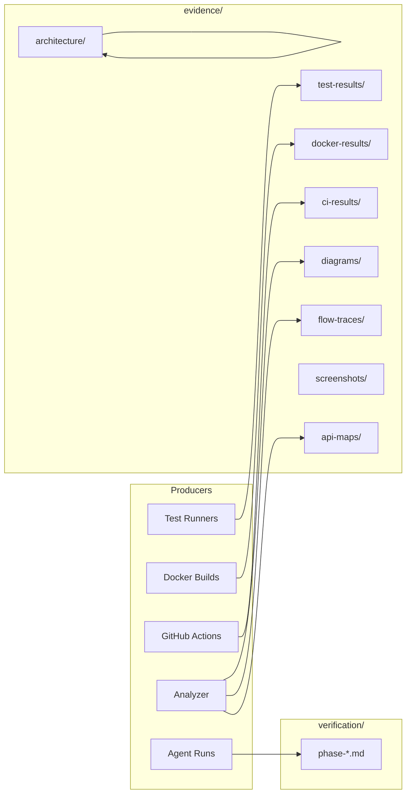

# Data Flow Diagram

## 1. Level 0 — Context Data Flow



---

## 2. KYC Data Flow (Detailed)



---

## 3. Entity-Relationship Model (Planned)



> **Note:** PAN and bank account numbers stored as hashes only; raw values never persisted (Phase 2 implementation).

---

## 4. Repository Intelligence Data Flow



---

## 5. Inventory JSON Schema (Analyzer Contract)

```json
{
  "repository": "/absolute/path",
  "framework": "fastapi | spring_boot | node_express",
  "confidence": 0.92,
  "generated_at": "2026-06-16T12:00:00Z",
  "inventories": {
    "services": [{ "name": "CustomerService", "file": "app/services/customer_service.py", "line": 12 }],
    "controllers": [{ "name": "customers.router", "file": "app/routers/customers.py", "line": 8 }],
    "apis": [{ "method": "POST", "path": "/customers", "handler": "create_customer", "file": "...", "line": 24 }],
    "models": [{ "name": "Customer", "table": "customers", "file": "...", "line": 6 }],
    "tests": [{ "name": "test_create_customer", "file": "tests/test_customers.py", "line": 10 }],
    "dependencies": [{ "name": "fastapi", "version": "0.111.0", "source": "pyproject.toml" }]
  },
  "flow_traces": [{
    "endpoint": "POST /customers",
    "chain": ["router.create_customer", "CustomerService.create", "CustomerRepository.insert", "customers"],
    "confidence": 0.88,
    "uncertainties": ["Dynamic dispatch in middleware not traced"]
  }]
}
```

---

## 6. Evidence Store Data Flow



---

## 7. Log & Metric Data Flow

| Stage | Data | Format | Destination |
|-------|------|--------|-------------|
| Request ingress | `request_id`, `method`, `path` | JSON (structlog) | stdout → collector |
| KYC event | `customer_id`, `kyc_status` (no PII) | JSON | stdout |
| Error | `exception`, `stack`, `request_id` | JSON | stdout |
| Metric increment | `http_requests_total` | Prometheus | `/metrics` endpoint |
| Scrape | all metrics | text exposition | Prometheus TSDB |
| Dashboard | PromQL results | panels | Grafana JSON |

---

## 8. Data Classification

| Data Type | Sensitivity | Storage | Retention |
|-----------|-------------|---------|-----------|
| Customer PII | High | PostgreSQL (encrypted) | Policy-driven |
| PAN/Bank raw input | High | Transient only; hashed at rest | Not stored raw |
| Analyzer reports | Low | `evidence/` git | Version controlled |
| Metrics | Low | Prometheus TSDB | 15 days (dev) |
| CI artifacts | Low | GitHub Actions | 90 days |

---

## 9. Risk Assessment

| Risk | Data Impact | Mitigation |
|------|-------------|------------|
| PII in logs | Compliance violation | structlog processors redact fields |
| Path traversal in analyzer | Read arbitrary FS | Canonicalize paths; allowlist roots |
| Stale ER diagram | Wrong architecture view | Regenerate on CI; timestamp on reports |
| Large repo OOM in Rust | Crash | File batching; max file size limit |

---

## 10. Evaluation Mapping

| Dimension | Coverage |
|-----------|----------|
| B2 | API map output flow |
| B3 | ER diagram in §3 |
| B4 | Flow trace pipeline §4 |
| B5 | Test inventory in schema §5 |
| D2 | Evidence store layout §6 |
| D3 | JSON schema contract §5 |
