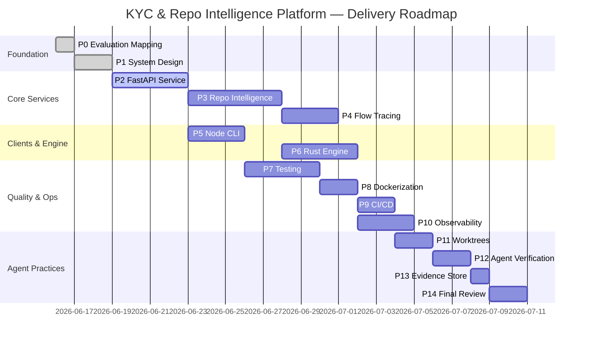
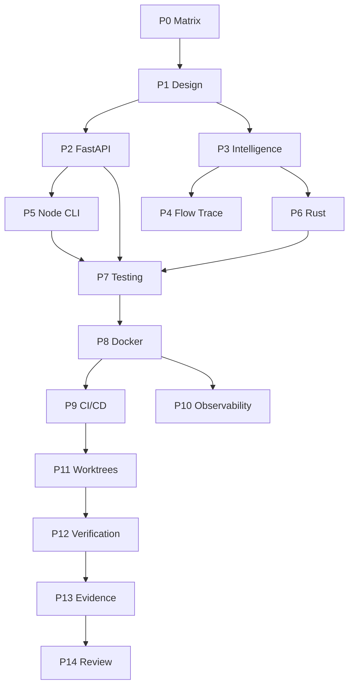

# Development Roadmap

## 1. Phase Overview

---

## 2. Phase Details

### Phase 0 — Evaluation Mapping ✅

| Deliverable | Status |
|-------------|--------|
| B/I/A/D taxonomy | Complete |
| Feature matrix | Complete |
| Coverage percentages | Complete |
| Gap analysis | Complete |

**Exit criteria:** Matrix reviewed; verification file committed.

---

### Phase 1 — System Design ✅

| Deliverable | Status |
|-------------|--------|
| High-level architecture | Complete |
| Component diagram | Complete |
| Sequence diagrams | Complete |
| Data flow + ER model | Complete |
| Folder structure | Complete |
| Technology rationale | Complete |

**Exit criteria:** `docs/architecture/` complete; diagrams render in Mermaid; verification file committed.

---

### Phase 2 — FastAPI Service

| Deliverable | Evaluation |
|-------------|------------|
| 9 REST endpoints | I1, B6 |
| SQLAlchemy models + Alembic | B3, D6 |
| Service + repository layers | D6 |
| Structured logging + exceptions | I6, D4 |
| pytest unit + integration tests | B5, D5 |

**Exit criteria:** `pytest` green; OpenAPI at `/docs`; `verification/phase-2.md` with curl examples.

---

### Phase 3 — Repository Intelligence Engine

| Deliverable | Evaluation |
|-------------|------------|
| Spring Boot, FastAPI, Node detectors | B1 |
| Six inventory reports | B1, B5 |
| ER diagram generator | B3 |
| API map generator | B2 |
| Flow trace stub | B4 |

**Exit criteria:** Analyze this repo; outputs in `evidence/`; markdown reports valid.

---

### Phase 4 — Flow Tracing

| Deliverable | Evaluation |
|-------------|------------|
| Request → DB chain resolver | B4 |
| Mermaid sequence per endpoint | B4, D3 |
| Uncertainty report | D4 |

**Exit criteria:** Flow traces for onboarding-api endpoints; confidence scores documented.

---

### Phase 5 — Node.js CLI

| Deliverable | Evaluation |
|-------------|------------|
| `customer-create` | I2, B6 |
| `submit-kyc` | I2, B6 |
| `generate-report` | I2, B1 |
| Jest/Vitest unit tests | D5 |

**Exit criteria:** CLI integration against running API; test coverage report.

---

### Phase 6 — Rust Engine

| Deliverable | Evaluation |
|-------------|------------|
| File walker + parsers | I3, B1 |
| Risk score calculation | B6, I3 |
| `cargo test` + benchmarks | D5, D2 |

**Exit criteria:** Benchmark results in `evidence/test-results/`; JSON output schema validated.

---

### Phase 7 — Testing

| Deliverable | Evaluation |
|-------------|------------|
| Pytest coverage ≥ 80% critical paths | B5, D5 |
| Node + Rust test suites | I2, I3 |
| Integration tests (API + DB) | B6 |
| E2E test (CLI → API → DB) | B4, B6 |

**Exit criteria:** Coverage reports in `evidence/test-results/`.

---

### Phase 8 — Dockerization

| Deliverable | Evaluation |
|-------------|------------|
| Dockerfiles (API, Node, Rust) | I4 |
| docker-compose.yml | I4 |
| Health checks | I4, I6 |
| Build/run proof | D2 |

**Exit criteria:** `docker compose up` healthy; evidence in `evidence/docker-results/`.

---

### Phase 9 — CI/CD

| Deliverable | Evaluation |
|-------------|------------|
| GitHub Actions workflow | I5 |
| Lint + test + docker stages | I5, D5 |
| Artifact upload | D2 |
| Failure example documentation | D4 |

**Exit criteria:** Green CI on main; failure replay documented.

---

### Phase 10 — Observability

| Deliverable | Evaluation |
|-------------|------------|
| Prometheus metrics | I6 |
| Grafana dashboard JSON | I6, D2 |
| KYC/risk-specific metrics | B6, I6 |

**Exit criteria:** Dashboard screenshot in `evidence/screenshots/`.

---

### Phase 11 — Worktree Demonstration

| Deliverable | Evaluation |
|-------------|------------|
| `analysis-worktree` branch demo | A1 |
| `observability-worktree` branch demo | A1 |
| Merge + conflict strategy doc | A1, D3 |

**Exit criteria:** Commands reproducible; doc in `docs/worktrees/`.

---

### Phase 12 — Agent vs Manual Verification

| Deliverable | Evaluation |
|-------------|------------|
| `verification/phase-{0..14}.md` | A2, D5 |
| Agent suggested vs implemented | A2 |
| Risk assessment per phase | D4 |

**Exit criteria:** All 15 verification files populated.

---

### Phase 13 — Engineering Evidence

| Deliverable | Evaluation |
|-------------|------------|
| Populated `evidence/` tree | D2 |
| Evidence index script | D5 |

**Exit criteria:** Every major claim has a linked artifact.

---

### Phase 14 — Final Review

| Deliverable | Evaluation |
|-------------|------------|
| Scorecard B1–B6, I1–I6, A1–A2, D2–D6 | All |
| Gap analysis + improvements | D4, D6 |

**Exit criteria:** Published review in `docs/final-review.md`.

---

## 3. Dependency Graph

---

## 4. Parallelization Opportunities

| Stream | Phases | Isolation |
|--------|--------|-----------|
| **Domain API** | P2 → P5 → P7 (API tests) | `services/onboarding-api/` |
| **Intelligence** | P3 → P4 → P6 | `engines/` |
| **Ops** | P8 → P9 → P10 | `infra/`, `.github/` |
| **Agent demo** | P11 → P12 | git worktrees |

Phases P2 and P3 can start in parallel after P1 (different directories, minimal coupling).

---

## 5. Milestones

| Milestone | Phases | Demo |
|-----------|--------|------|
| **M1 — Design Complete** | P0, P1 | Architecture walkthrough |
| **M2 — Working API** | P2 | curl create customer + KYC |
| **M3 — Repo Analyzer** | P3, P4, P6 | generate-report on sample repo |
| **M4 — Full Stack** | P5, P7, P8 | CLI → API → DB in Docker |
| **M5 — Production Patterns** | P9, P10 | CI green + Grafana dashboard |
| **M6 — Agent Excellence** | P11–P14 | Evidence pack + scorecard |

---

## 6. Risk Assessment

| Risk | Phase Impact | Mitigation |
|------|--------------|------------|
| Scope creep | All | Strict phase gates; user approval between phases |
| Integration delays | P5, P7 | Mock API for CLI dev before P2 complete |
| Analyzer accuracy | P3, P4 | Uncertainty reports; golden-file tests |
| CI flakiness | P9 | Retry policy; deterministic test DB |

---

## 7. Evaluation Mapping

| Dimension | Coverage |
|-----------|----------|
| D3 | Phase dependency graph |
| D4 | Per-phase risks |
| D5 | Exit criteria per phase |
| D6 | Folder conventions referenced |
| A1 | Parallel streams + worktree phase |
