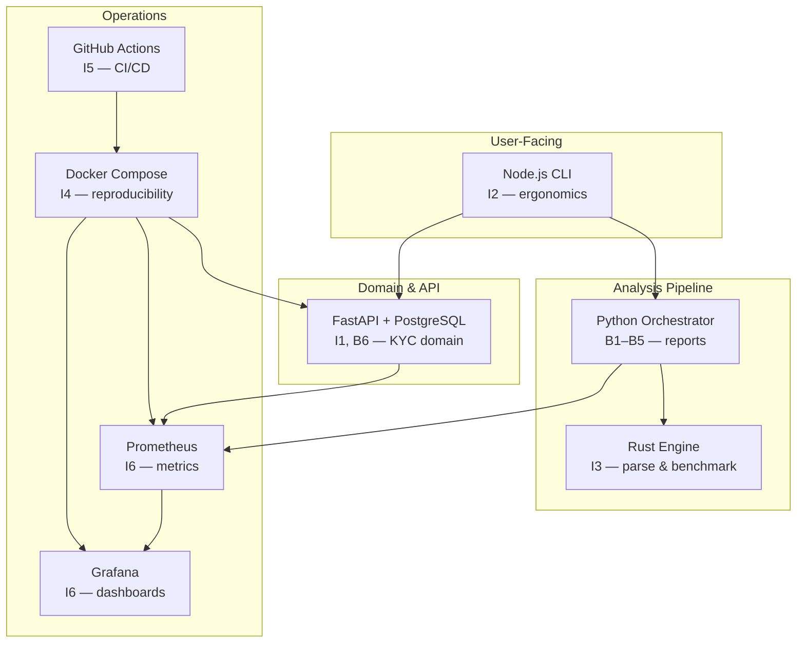

# Technology Rationale

This document explains **why** each major technology was chosen. Every claim links to a concrete project requirement.

---

## 1. FastAPI — Onboarding & KYC Service

### Why FastAPI?

| Factor | Rationale |
|--------|-----------|
| **Evaluation target (I1)** | Project explicitly requires production-grade FastAPI with Pydantic, SQLAlchemy, structured logging |
| **OpenAPI-first** | Auto-generated `/docs` supports B2 API Mapping — the analyzer can ingest its own OpenAPI as ground truth |
| **Pydantic v2 validation** | KYC inputs (PAN format, IFSC, email) need strict validation at the boundary |
| **Async-ready** | External PAN/bank verification calls benefit from `async def` + `httpx` without blocking the event loop |
| **Ecosystem maturity** | SQLAlchemy 2.0, Alembic, pytest, prometheus_client integrate cleanly |
| **Agent familiarity** | Coding agents produce high-quality FastAPI code — supports A2 agent-vs-manual comparison |

### Tradeoffs

| Alternative | Why Not Primary |
|-------------|-----------------|
| Django REST | Heavier ORM opinions; slower OpenAPI path |
| Flask | No native validation; more boilerplate for production patterns |
| Spring Boot | Required as analysis *target*, not implementation language for this service |

### Traceability

- Endpoints: [03-sequence-diagrams.md](./03-sequence-diagrams.md) §8
- Layer layout: [05-folder-structure.md](./05-folder-structure.md) §2

---

## 2. Node.js — CLI Client

### Why Node.js?

| Factor | Rationale |
|--------|-----------|
| **Evaluation target (I2)** | Project requires CLI with validation, error handling, unit tests |
| **Developer ergonomics** | Onboarding operators and analysts expect `npx kyc-cli customer-create` style commands |
| **HTTP client maturity** | `fetch` / `axios` for FastAPI; easy multipart if document upload added later |
| **Rapid CLI frameworks** | `commander` or `yargs` for subcommands with minimal code |
| **Cross-platform** | macOS/Linux/Windows without compilation (unlike Rust CLI for end users) |

### Tradeoffs

| Alternative | Why Not Primary |
|-------------|-----------------|
| Python Click | Duplicates language with API; Node demonstrates polyglot stack (I2) |
| Rust CLI for users | Better for engine (I3); slower iteration for command UX changes |
| curl scripts | No validation, poor error messages, weak test story |

### Responsibilities (Bounded)

Node CLI is **only** the human/agent-facing client — not business logic. All domain rules stay in FastAPI.

---

## 3. Rust — Repository Analysis Engine

### Why Rust?

| Factor | Rationale |
|--------|-----------|
| **Evaluation target (I3)** | Project requires Rust CLI with parsing, file analysis, risk calculation, benchmarks |
| **Performance** | Scanning 10k+ files for B1 Repo Discovery needs speed; Rust targets >500 files/sec |
| **Memory safety** | Parsing untrusted repos (path traversal, malformed sources) — bounds checks without GC pauses |
| **Benchmark credibility** | `criterion` benches produce evidence artifacts (D2) agents and humans can reproduce |
| **Polyglot demonstration** | Shows when to reach for systems language vs Python orchestration |

### Architecture Pattern

```
Python orchestrator  →  policy, report generation, framework detection
Rust engine          →  file walk, parse, graph, numeric risk score
```

Start with **CLI subprocess** (stdin/stdout JSON) — simplest integration, clearest evidence in CI logs. FFI optional in future.

### Tradeoffs

| Alternative | Why Not Primary |
|-------------|-----------------|
| Pure Python (tree-sitter) | Sufficient for MVP but weaker I3 benchmark story |
| Go | Strong alternative; Rust chosen for explicit evaluation requirement |
| Java parser | Heavier; project already uses Java as Spring *analysis target* |

---

## 4. Docker — Containerization

### Why Docker?

| Factor | Rationale |
|--------|-----------|
| **Evaluation target (I4)** | Multi-service stack: FastAPI, Node, Rust, PostgreSQL, Prometheus, Grafana |
| **Reproducibility** | Same compose file for dev, CI, and evidence capture (D2) |
| **Health checks** | `depends_on` + `/health` endpoints prove service readiness |
| **Agent verification** | Agents can `docker compose up` and curl endpoints — concrete pass/fail |
| **Isolation** | Analyzer runs in container with read-only volume mount on target repo |

### Compose Service Map

| Container | Image Base | Purpose |
|-----------|------------|---------|
| `onboarding-api` | python:3.12-slim | KYC API |
| `postgres` | postgres:16-alpine | Persistence |
| `node-cli` | node:20-alpine | CLI tooling (dev profile) |
| `prometheus` | prom/prometheus | Metrics scrape |
| `grafana` | grafana/grafana | Dashboards |

Rust analyzer: built as multi-stage binary copied into intelligence container (no separate long-running service).

### Tradeoffs

| Alternative | Why Not Primary |
|-------------|-----------------|
| Local-only venv | No I4 evidence; "works on my machine" |
| Kubernetes | Overkill for demo; compose satisfies evaluation |
| Podman | Compatible alternative; compose syntax portable |

---

## 5. Prometheus + Grafana — Observability

### Why Prometheus?

| Factor | Rationale |
|--------|-----------|
| **Evaluation target (I6)** | Metrics endpoint `/metrics` on FastAPI |
| **Pull model** | Services expose metrics; no sidecar agent required in dev |
| **PromQL** | Standard queries for request rate, error rate, latency (RED method) |
| **CI-friendly** | Scrape config in git; evidence via exported query results |

### Why Grafana?

| Factor | Rationale |
|--------|-----------|
| **Dashboard as code** | JSON dashboard in `infra/grafana/dashboards/` — version controlled (D2) |
| **KYC-specific panels** | kyc_submissions_total, risk_score_histogram |
| **Demo value** | Screenshot evidence for human reviewers |
| **Industry standard** | Pairing with Prometheus is universally recognized (I6) |

### Metrics Plan

| Metric | Type | Business Question |
|--------|------|-----------------|
| `http_requests_total` | Counter | How many API calls? |
| `http_request_duration_seconds` | Histogram | Is latency acceptable? |
| `kyc_submissions_total` | Counter | KYC throughput by status? |
| `risk_score_histogram` | Histogram | Risk distribution? |
| `analyzer_runs_total` | Counter | How often is repo analysis run? |

### Tradeoffs

| Alternative | Why Not Primary |
|-------------|-----------------|
| Datadog / New Relic | SaaS cost; less reproducible in open repo |
| OpenTelemetry only | Better for traces; metrics + dashboard explicitly required |
| Logs-only | Insufficient for I6 latency/rate SLOs |

---

## 6. PostgreSQL — Primary Database

| Factor | Rationale |
|--------|-----------|
| Relational KYC data | Customers, submissions, assessments — clear FK relationships (B3 ER) |
| SQLAlchemy support | First-class in FastAPI stack |
| JSON columns | Store provider responses flexibly |
| Docker availability | Official image; healthcheck via `pg_isready` |

---

## 7. Python — Intelligence Orchestrator

| Factor | Rationale |
|--------|-----------|
| Same ecosystem as FastAPI | Shared Pydantic models for inventory schema |
| Report generation | Jinja2/markdown templates for B1–B5 outputs |
| Agent productivity | Most analyzer glue code written faster in Python |
| Delegates heavy work to Rust | Clear separation of concerns |

---

## 8. Technology Decision Summary



---

## 9. ADR Index (Architecture Decision Records)

| ADR | Decision | Status |
|-----|----------|--------|
| ADR-001 | FastAPI for KYC service | Accepted |
| ADR-002 | Node.js for CLI only (no business logic) | Accepted |
| ADR-003 | Rust via CLI subprocess (not FFI v1) | Accepted |
| ADR-004 | PostgreSQL over SQLite | Accepted |
| ADR-005 | Prometheus pull + Grafana dashboards | Accepted |
| ADR-006 | docker-compose for local/CI parity | Accepted |
| ADR-007 | Phase-gated delivery (no big-bang) | Accepted |

Full ADRs will be added to `docs/architecture/adr/` as implementation proceeds.

---

## 10. Risk Assessment

| Decision | Risk | Mitigation |
|----------|------|------------|
| Polyglot (3 languages) | Integration complexity | Clear boundaries; JSON contracts; compose stack |
| Rust subprocess latency | Cold start on small repos | Acceptable for analysis; benchmark documented |
| Prometheus cardinality | High-cardinality path labels | Normalize paths; limit label sets |
| Mock external verifiers | Not production-realistic | Document as dev stubs; interface abstracted |

---

## 11. Evaluation Mapping

| Dimension | Document Section |
|-----------|------------------|
| I1 | §1 FastAPI |
| I2 | §2 Node.js |
| I3 | §3 Rust |
| I4 | §4 Docker |
| I5 | §8 diagram (GitHub Actions) |
| I6 | §5 Prometheus/Grafana |
| D3 | ADR index §9 |
| D4 | Risk §10 |
