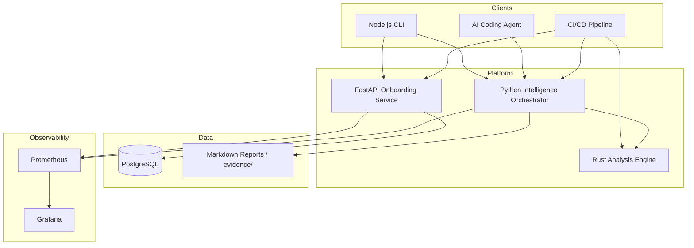

# Architecture Documentation

**Project:** AI-Powered KYC & Onboarding Repository Intelligence Platform  
**Phase:** 1 — System Design  
**Status:** Approved for implementation (Phase 2+)

---

## Document Index

| Document | Purpose |
|----------|---------|
| [01-high-level-architecture.md](./01-high-level-architecture.md) | System context, boundaries, and deployment view |
| [02-component-diagram.md](./02-component-diagram.md) | Internal components and dependencies |
| [03-sequence-diagrams.md](./03-sequence-diagrams.md) | Key interaction flows (KYC, analysis, CLI) |
| [04-data-flow.md](./04-data-flow.md) | Data movement, storage, and report generation |
| [05-folder-structure.md](./05-folder-structure.md) | Repository layout and conventions |
| [06-development-roadmap.md](./06-development-roadmap.md) | Phase-gated delivery plan |
| [07-technology-rationale.md](./07-technology-rationale.md) | Why FastAPI, Node, Rust, Docker, Prometheus/Grafana |

---

## System Summary

The platform combines two concerns:

1. **KYC & Onboarding Domain** — A FastAPI microservice managing customer lifecycle, document verification (PAN, bank), and risk scoring.
2. **Repository Intelligence** — A polyglot analysis pipeline (Python orchestrator + Rust engine + Node CLI) that ingests codebases, produces inventories, API maps, ER diagrams, and end-to-end flow traces.

Both concerns share observability infrastructure (Prometheus/Grafana), CI/CD, and an evidence store for agent-vs-manual verification.

---

## Architectural Principles

1. **Layered boundaries** — Controller → Service → Repository in FastAPI; no business logic in HTTP handlers.
2. **Polyglot by responsibility** — Python for API and orchestration, Rust for CPU-bound parsing, Node for developer-facing CLI ergonomics.
3. **Evidence over claims** — Every analyzer output lands in `evidence/` with reproducible commands.
4. **Uncertainty is explicit** — Flow tracer emits confidence scores and unresolved edges.
5. **Phase-gated delivery** — No phase starts until prior verification artifacts exist.

---

## Quick Reference Diagram

---

## Traceability

| Claim | Evidence Location |
|-------|-------------------|
| Three-language split | [07-technology-rationale.md](./07-technology-rationale.md) |
| KYC endpoint contract | [03-sequence-diagrams.md](./03-sequence-diagrams.md) |
| Analyzer output schema | [04-data-flow.md](./04-data-flow.md) |
| Folder conventions | [05-folder-structure.md](./05-folder-structure.md) |
| Delivery timeline | [06-development-roadmap.md](./06-development-roadmap.md) |
