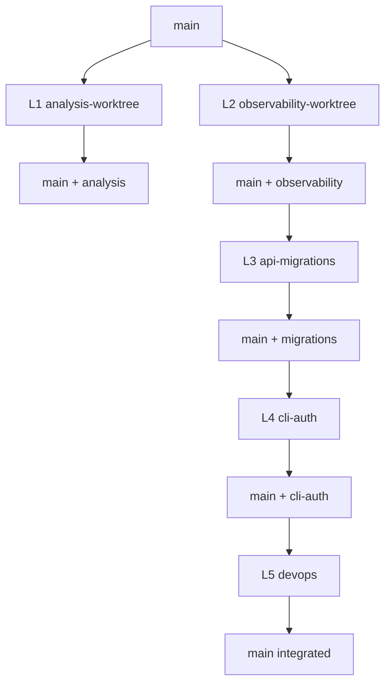

# A1 — Multi-Worktree Parallel Planning

**Evaluation criterion:** A1 (Multi Worktree Planning)  
**Selected initiative:** **Production Readiness Sprint** (Alembic + API auth + CLI auth + infra secrets)  
**Existing evidence:** 2 executed worktrees (analysis, observability) — Phase 11  
**Verification date:** 2026-06-20T05:45:00Z (UTC)  
**Evidence:** `evidence/test-results/a1-run-2026-06-20-1115/`  
**Machine-readable:** `lanes.csv`, `agent-prompts.md`

---

## 1. Executive Summary

| Finding | Result | Confidence |
|---------|--------|------------|
| Parallel planning docs exist | **PASS** — `docs/parallel-development.md`, `docs/worktrees/merge-strategy.md` | High |
| Worktree demo script | **PASS** — `scripts/worktree-demo.sh`, `make worktree-demo` | High |
| Active worktrees in repo | **2** — analysis + observability | High — `git worktree list` |
| 5-lane decomposition | **Documented** — 2 executed + 3 planned | High |
| Agent prompts per lane | **PASS** — `agent-prompts.md` | High |
| Merge order + conflict matrix | **PASS** — `merge-strategy.md` | High |
| Verification plan | **PASS** — `make test`, `make ci-local` | High |

**Overall A1 status: PASS (9/10)** — planning artifacts and path ownership are repository-backed; 3 lanes are forward-looking.

---

## 2. Selected Feature for Parallel Execution

### Initiative: Production Readiness Sprint

Gaps identified across B4, I4, I5, and modernization reports:

| Gap | Lane |
|-----|------|
| No Alembic migrations (`create_all` only) | L3 api-migrations |
| Optional API key not wired in Node CLI | L4 cli-auth |
| Dev credentials in compose | L5 devops |
| Intelligence + observability ongoing | L1, L2 (active) |

**Why parallel-safe:** Each lane owns disjoint directory trees per `merge-strategy.md` path ownership table.

---

## 3. Task Decomposition (Independent Lanes)

| Lane | Branch | Worktree | Scope | Deliverables | Dependencies |
|------|--------|----------|-------|--------------|--------------|
| **L1** analysis | `analysis-worktree` | `.worktrees/analysis` | Intelligence + Rust | API maps, flow traces | None |
| **L2** observability | `observability-worktree` | `.worktrees/observability` | Metrics + Grafana | Dashboards, metrics catalog | None |
| **L3** api-migrations | `feature/api-migrations` | `.worktrees/api-migrations` | Alembic for API | Migrations, tests | Model schema stable |
| **L4** cli-auth | `feature/cli-auth` | `.worktrees/cli-auth` | Node CLI auth header | `--api-key`, tests | API contract for `X-API-Key` |
| **L5** devops | `feature/devops` | `.worktrees/devops` | Secrets in compose/k8s | Env/Secret manifests | L3/L4 env names |

**CSV:** `lanes.csv`

### Files likely to change (by lane)

| Lane | Paths |
|------|-------|
| L1 | `engines/intelligence/**`, `engines/rust-analyzer/**`, `evidence/api-maps/` |
| L2 | `infra/grafana/**`, `infra/prometheus/**`, `app/core/metrics.py`, `docs/observability/` |
| L3 | `services/onboarding-api/alembic/**`, `app/models/**`, `app/main.py` (lifespan) |
| L4 | `clients/node-cli/lib/api-client.js`, `bin/kyc-cli.js`, `tests/*.test.js` |
| L5 | `infra/docker/docker-compose.yml`, `infra/kubernetes/**`, `.github/workflows/ci.yml` |

---

## 4. Worktree / Branch Strategy

### Executed (Phase 11 — verified)

```bash
git worktree list
# main                          40f00f6 [main]
# .worktrees/analysis           71fdac1 [analysis-worktree]
# .worktrees/observability      3f1395e [observability-worktree]
```

| Worktree path | Branch | Purpose |
|---------------|--------|---------|
| `.worktrees/analysis` | `analysis-worktree` | Intelligence / Rust engine |
| `.worktrees/observability` | `observability-worktree` | Metrics / Grafana |

**Markers:** `engines/intelligence/WORKTREE_MARKER.md`, `docs/observability/WORKTREE_MARKER.md`

### Planned (create before sprint)

```bash
git checkout main
git branch feature/api-migrations
git worktree add .worktrees/api-migrations feature/api-migrations

git branch feature/cli-auth
git worktree add .worktrees/cli-auth feature/cli-auth

git branch feature/devops
git worktree add .worktrees/devops feature/devops
```

---

## 5. Agent Prompts

Full copy-paste prompts per lane: **`agent-prompts.md`**

Each prompt includes: worktree path, allowed directories, task, constraints, test commands, deliverables.

---

## 6. Shared Constraints

| Area | Constraint | Source |
|------|------------|--------|
| **Layering** | `routers → services → repositories → models` | `CONTRIBUTING.md` |
| **API contract** | OpenAPI in `docs/api/openapi.json`; export after API changes | `Makefile` `export-openapi` |
| **Data contract** | SQLAlchemy models in `app/models/`; ER in `docs/er-diagram.md` | I1 report |
| **Testing** | Lane-specific pytest/npm/cargo + `make test` on merge | `scripts/run-all-tests.sh` |
| **Safe change** | `make safe-change-check` before PR to `main` | `docs/safe-change.md` |
| **DB tests** | In-memory `get_db` override — never persistent `onboarding.db` | `docs/bug-investigation.md` BUG-001 |
| **Documentation** | Update `verification/phase-N.md` if phase scope changes | `CONTRIBUTING.md` |
| **Commits** | `--no-ff` merge to `main`; conventional prefixes | `merge-strategy.md` |

---

## 7. Merge Order



| Order | Branch | Rationale |
|-------|--------|-----------|
| 1 | `analysis-worktree` | Isolated under `engines/` |
| 2 | `observability-worktree` | May reference new analysis outputs |
| 3 | `feature/api-migrations` | Schema before auth enforcement changes |
| 4 | `feature/cli-auth` | Depends on API auth contract |
| 5 | `feature/devops` | Wires secrets for finalized env vars |

```bash
git checkout main
git merge --no-ff analysis-worktree -m "merge: analysis-worktree into main"
git merge --no-ff observability-worktree -m "merge: observability-worktree into main"
git merge --no-ff feature/api-migrations -m "merge: api migrations into main"
git merge --no-ff feature/cli-auth -m "merge: cli auth into main"
git merge --no-ff feature/devops -m "merge: devops secrets into main"
make test && make ci-local
```

**Source:** `docs/worktrees/merge-strategy.md`, `docs/parallel-development.md`

---

## 8. Conflict-Risk Assessment

| Pair | Risk | High-risk files | Mitigation |
|------|------|-----------------|------------|
| L2 ↔ L3 | **Medium** | `app/core/metrics.py` vs `app/main.py` | Path ownership; merge L2 before L3 touches API |
| L3 ↔ L4 | Low | OpenAPI only | L3 first; L4 client-only |
| L4 ↔ L5 | Low | `API_KEY` env name | Agree contract in shared doc before coding |
| Any ↔ **main** | Medium | `README.md`, `Makefile` | Union edits; sort `.PHONY` targets |
| L1 ↔ L2 | **Low** | Disjoint trees | Enforced by WORKTREE_MARKER isolation notes |

### High-risk files (coordinate merges)

- `services/onboarding-api/app/core/metrics.py`
- `services/onboarding-api/app/main.py`
- `Makefile`
- `README.md`
- `infra/docker/docker-compose.yml`

**Playbook:** `merge-strategy.md` § Conflict resolution (Scenarios A–D)

---

## 9. Verification Plan

### Per-lane (before merge request)

| Lane | Command |
|------|---------|
| L1 | `cd engines/intelligence && PYTHONPATH=src pytest -q`; `cargo test -q` |
| L2 | `make observability-verify` |
| L3 | `cd services/onboarding-api && PYTHONPATH=. pytest -q` |
| L4 | `cd clients/node-cli && npm test` |
| L5 | `make docker-verify`; `make k8s-verify` |

### Integration (after each merge to main)

| Check | Command |
|-------|---------|
| Full test suite | `make test` |
| CI simulation | `make ci-local` |
| Safe change gate | `make safe-change-check` |
| Worktree demo regression | `make worktree-demo` |

### Build verification

| Component | Command |
|-----------|---------|
| Docker API image | `cd infra/docker && docker compose build onboarding-api` |
| Rust release | `cd engines/rust-analyzer && cargo build --release` |

**Evidence targets:** `evidence/worktrees/`, `evidence/test-results/`, `evidence/ci-results/`

---

## 10. Repository Evidence

| Artifact | Path | Status |
|----------|------|--------|
| 5-stream plan | `docs/parallel-development.md` | 125 lines |
| Merge strategy | `docs/worktrees/merge-strategy.md` | 116 lines |
| Worktree README | `docs/worktrees/README.md` | Present |
| Demo script | `scripts/worktree-demo.sh` | Present |
| Phase 11 evidence | `evidence/worktrees/phase-11-worktree-demo.txt` | Present |
| Live worktrees | `git worktree list` | 2 active |

---

## 11. Findings and Recommendations

### Strengths

1. Path ownership table prevents most cross-lane edits.
2. Phase 11 demo proves merge workflow with real git history.
3. `make worktree-demo` is reproducible for auditors.

### Gaps

1. L3–L5 worktrees not yet created (planning only).
2. `feature/worker` stream documented but not implemented.
3. Root README does not list all five streams — see `parallel-development.md`.

### Recommendations

1. Create planned worktrees only when sprint starts (avoid stale branches).
2. Add `docs/polyglot-quickstart.md` for cross-lane API contract.
3. Run weekly `git rebase main` on long-lived worktrees.

---

## 12. Areas Requiring Manual Verification

| Item | Reason |
|------|--------|
| L3–L5 execution | Planning-only in this A1 run |
| Multi-agent simultaneous merge | Human review of `Makefile` conflicts |
| Remote PR from worktrees | A2 criterion |

---

## 13. Verification Summary

| Step | Result |
|------|--------|
| `test -f docs/worktrees/merge-strategy.md` | **PASS** |
| `test -f docs/parallel-development.md` | **PASS** |
| `git worktree list` | **2 worktrees** |
| Lane decomposition | **5 lanes** in `lanes.csv` |
| Agent prompts | **5 prompts** in `agent-prompts.md` |
| Merge order documented | **PASS** |
| Conflict matrix | **PASS** |

**A1 verdict: PASS**

---

*Planning references executed Phase 11 worktrees and extends with Production Readiness Sprint lanes L3–L5.*
