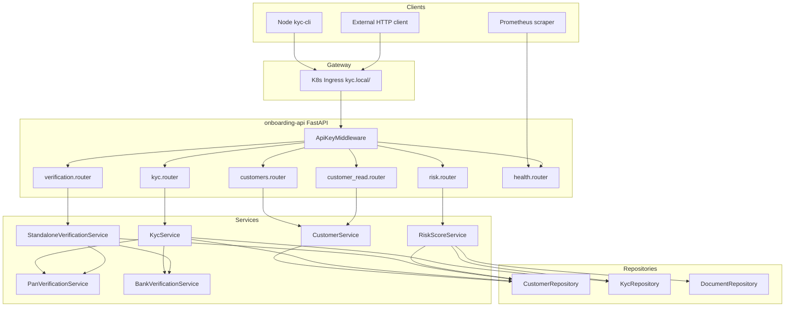
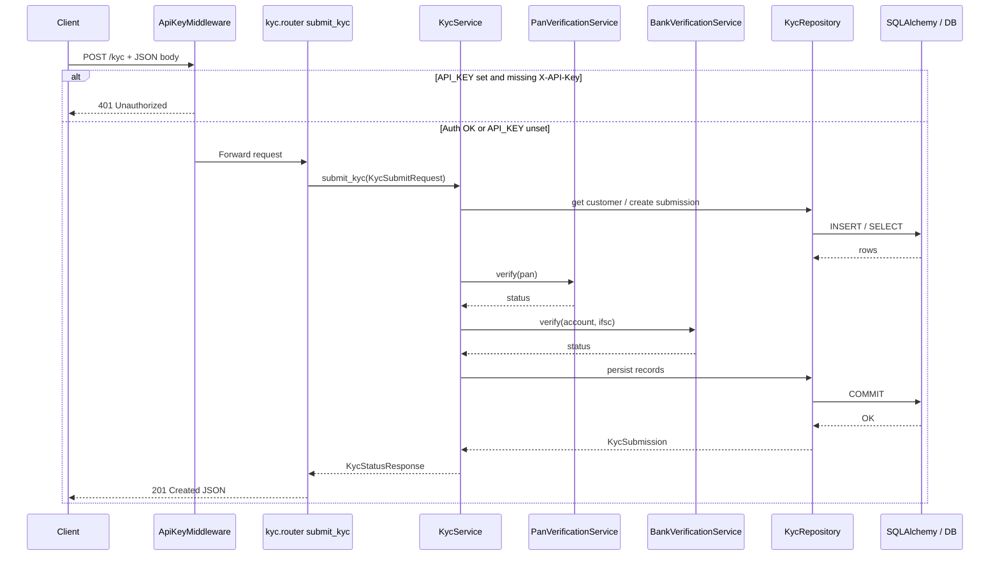

# B2 — API Endpoint Map

**Evaluation criterion:** B2 (API Mapping)  
**Repository:** AI-Powered KYC & Onboarding Repository Intelligence Platform  
**Scan date:** 2026-06-18  
**Verification:** Live FastAPI route enumeration + static source scan + `docs/api/openapi.json` cross-check

---

## Executive Summary

| Category | Count | Notes |
|----------|------:|-------|
| **REST API endpoints (onboarding-api)** | **13** | 7 business + 2 operational + 4 FastAPI framework routes |
| **Frontend routes / pages** | **0** | No React, Vue, Next.js, or static SPA in repository |
| **Webhooks** | **0** | No `@webhook`, callback handlers, or inbound webhook routes found |
| **GraphQL endpoints** | **0** | No GraphQL schema, resolvers, or `/graphql` route found |
| **WebSocket endpoints** | **0** | No `@router.websocket`, `WebSocket`, or WS upgrade handlers found |
| **Gateway routes** | **1** | Kubernetes Ingress `kyc.local/` → `onboarding-api:8000` |
| **Infra health / observability HTTP** | **4** | Prometheus `/-/healthy`, Grafana `/health`, plus inferred Prometheus/Grafana UI roots |
| **Internal service-to-service HTTP** | **1** | Prometheus scrape of `onboarding-api:8000/metrics` (Docker/K8s network) |

**Primary HTTP server:** `services/onboarding-api` (FastAPI + uvicorn on port 8000)  
**OpenAPI export:** `docs/api/openapi.json` — **9 paths** (business + operational; excludes FastAPI auto `/docs` routes)

**Public vs secured (onboarding-api):**

| Mode | Public routes | Secured routes |
|------|--------------:|---------------:|
| `API_KEY` unset (default dev/test) | **13** (all routes) | **0** |
| `API_KEY` set (production-style) | **6** path prefixes (`/health`, `/metrics`, `/docs`, `/openapi.json`, `/redoc`) | **7** business routes (require `X-API-Key` header) |

**Role-protected endpoints:** **0** — no RBAC, OAuth scopes, or role decorators in codebase.

**Top modules exposing APIs:**

| Module | Routes | Source directory |
|--------|-------:|------------------|
| customers | 2 | `app/routers/customers.py`, `app/routers/customer_read.py` |
| kyc | 2 | `app/routers/kyc.py` |
| verification | 2 | `app/routers/verification.py` |
| health / observability | 2 | `app/routers/health.py` |
| risk | 1 | `app/routers/risk.py` |
| FastAPI framework | 4 | Auto-registered by `FastAPI()` in `app/main.py` |

---

## Scan Methodology

1. Recursive repository grep for `APIRouter`, `@router.*`, `FastAPI`, `WebSocket`, `graphql`, `webhook`, `ingress`, `express`, HTTP servers.
2. Read all files under `services/onboarding-api/app/routers/`.
3. Live verification:

```bash
cd services/onboarding-api && PYTHONPATH=. .venv/bin/python -c "
from app.main import app
for r in sorted(app.routes, key=lambda x: getattr(x,'path','')):
    m = sorted(getattr(r,'methods',None) or [])
    print(m, r.path)
"
```

4. Cross-checked output against `docs/api/openapi.json` (`jq '.paths | keys | length'` → **9**).
5. Reviewed `infra/docker/docker-compose.yml`, `infra/kubernetes/kyc-platform.yaml`, `infra/prometheus/prometheus.yml`.
6. Confirmed **no frontend** (`*.tsx`, `*.jsx`, `*.vue`, `*.html` application sources): **0 files**.

**Not counted as exposed APIs:** Node CLI (`clients/node-cli/`) — HTTP **client only**, no listening server. Rust analyzer (`engines/rust-analyzer/`) — CLI only. Intelligence engine test fixtures — not deployed services.

---

## API Inventory

### onboarding-api — Business REST Endpoints

| HTTP Method | Route Path | Controller | Handler | Request DTO | Response DTO | Auth | Source File | Lines | Confidence |
|-------------|------------|------------|---------|-------------|--------------|------|-------------|-------|------------|
| POST | `/customers` | `customers.router` | `create_customer` | `CustomerCreate` | `CustomerResponse` (201) | API key when `API_KEY` set | `services/onboarding-api/app/routers/customers.py` | 11–13 | **Confirmed** |
| GET | `/customer/{customer_id}` | `customer_read.router` | `get_customer` | Path `customer_id: UUID` | `CustomerResponse` | API key when `API_KEY` set | `services/onboarding-api/app/routers/customer_read.py` | 13–15 | **Confirmed** |
| POST | `/kyc` | `kyc.router` | `submit_kyc` | `KycSubmitRequest` | `KycStatusResponse` (201) | API key when `API_KEY` set | `services/onboarding-api/app/routers/kyc.py` | 13–15 | **Confirmed** |
| GET | `/kyc-status/{customer_id}` | `kyc.router` | `get_kyc_status` | Path `customer_id: UUID` | `KycStatusResponse` | API key when `API_KEY` set | `services/onboarding-api/app/routers/kyc.py` | 18–20 | **Confirmed** |
| POST | `/pan-verify` | `verification.router` | `verify_pan` | `PanVerifyRequest` | `PanVerifyResponse` | API key when `API_KEY` set | `services/onboarding-api/app/routers/verification.py` | 16–18 | **Confirmed** |
| POST | `/bank-verify` | `verification.router` | `verify_bank` | `BankVerifyRequest` | `BankVerifyResponse` | API key when `API_KEY` set | `services/onboarding-api/app/routers/verification.py` | 21–23 | **Confirmed** |
| POST | `/risk-score` | `risk.router` | `calculate_risk_score` | `RiskScoreRequest` | `RiskScoreResponse` | API key when `API_KEY` set | `services/onboarding-api/app/routers/risk.py` | 11–15 | **Confirmed** |

**Decorator evidence:**

```11:13:services/onboarding-api/app/routers/customers.py
@router.post("", response_model=CustomerResponse, status_code=status.HTTP_201_CREATED)
def create_customer(data: CustomerCreate, db: Session = Depends(get_db)) -> CustomerResponse:
    return CustomerService(db).create_customer(data)
```

```13:15:services/onboarding-api/app/routers/customer_read.py
@router.get("/customer/{customer_id}", response_model=CustomerResponse)
def get_customer(customer_id: uuid.UUID, db: Session = Depends(get_db)) -> CustomerResponse:
    return CustomerService(db).get_customer(customer_id)
```

---

### onboarding-api — Health & Observability Endpoints

| HTTP Method | Route Path | Controller | Handler | Request | Response | Auth | Source File | Lines | Confidence |
|-------------|------------|------------|---------|---------|----------|------|-------------|-------|------------|
| GET | `/health` | `health.router` | `health_check` | None | `{status, service, version}` | **Always public** | `services/onboarding-api/app/routers/health.py` | 9–16 | **Confirmed** |
| GET | `/metrics` | `health.router` | `metrics` | None | Prometheus text (`CONTENT_TYPE_LATEST`) | **Always public** | `services/onboarding-api/app/routers/health.py` | 19–21 | **Confirmed** |

**Decorator evidence:**

```9:16:services/onboarding-api/app/routers/health.py
@router.get("/health")
def health_check() -> dict:
    settings = get_settings()
    return {
        "status": "healthy",
        "service": settings.app_name,
        "version": settings.app_version,
    }
```

Docker healthcheck also targets this route:

```30:31:infra/docker/docker-compose.yml
    healthcheck:
      test: ["CMD", "curl", "-fsS", "http://localhost:8000/health"]
```

---

### onboarding-api — FastAPI Framework Routes (auto-generated)

| HTTP Method | Route Path | Handler | Response | Auth | Registration | Confidence |
|-------------|------------|---------|----------|------|--------------|------------|
| GET, HEAD | `/docs` | Swagger UI | HTML | **Always public** | `FastAPI()` in `app/main.py:49` | **Confirmed** |
| GET, HEAD | `/docs/oauth2-redirect` | OAuth2 redirect helper | HTML | **Always public** (`/docs/` prefix) | `FastAPI()` in `app/main.py:49` | **Confirmed** |
| GET, HEAD | `/redoc` | ReDoc UI | HTML | **Always public** | `FastAPI()` in `app/main.py:49` | **Confirmed** |
| GET, HEAD | `/openapi.json` | OpenAPI schema | JSON | **Always public** | `FastAPI()` in `app/main.py:49` | **Confirmed** |

Router registration in `create_app()`:

```58:63:services/onboarding-api/app/main.py
    app.include_router(customers.router)
    app.include_router(customer_read.router)
    app.include_router(kyc.router)
    app.include_router(verification.router)
    app.include_router(risk.router)
    app.include_router(health.router)
```

---

### Gateway Routes

| Type | Host / Path | Backend | Source | Lines | Confidence |
|------|-------------|---------|--------|-------|------------|
| Kubernetes Ingress | `kyc.local` / `/` (Prefix) | Service `onboarding-api:8000` | `infra/kubernetes/kyc-platform.yaml` | 73–89 | **Confirmed** |

All onboarding-api paths are reachable through this ingress when deployed to a cluster with host `kyc.local`. No path-based routing rules beyond the single `/` prefix.

---

### Infrastructure HTTP Endpoints (third-party images)

| Service | HTTP Method | Route Path | Purpose | Exposed Port | Source | Confidence |
|---------|-------------|------------|---------|--------------|--------|------------|
| Prometheus | GET | `/-/healthy` | Liveness / health | `${PROMETHEUS_HOST_PORT:-9191}` | `infra/docker/docker-compose.yml:74-76` | **Confirmed** |
| Prometheus | GET | `/metrics` | Prometheus self-metrics | `:9191` | Standard Prometheus 2.x | **Inferred** |
| Prometheus | GET | `/api/v1/*` | Prometheus query API | `:9191` | Standard Prometheus 2.x | **Inferred** |
| Grafana | GET | `/health` | Health check | `${BUNDLED_GRAFANA_PORT:-3003}` | `infra/docker/docker-compose.yml:96-98` | **Confirmed** |
| Grafana | GET | `/`, `/login`, `/api/*` | Web UI & REST API | `:3003` | Standard Grafana 11.x | **Inferred** |

**Internal scrape (not host-published):**

| Scraper | Target | Path | Source | Confidence |
|---------|--------|------|--------|------------|
| Prometheus job `onboarding-api` | `onboarding-api:8000` | `/metrics` | `infra/prometheus/prometheus.yml:6-11` | **Confirmed** |

---

### Categories Not Present in Repository

| Category | Scan result |
|----------|-------------|
| GraphQL | **None** — no `graphql`, `graphene`, `strawberry`, or `/graphql` in codebase |
| WebSocket | **None** — no `@router.websocket` or WebSocket imports in application code |
| Webhooks / callbacks | **None** — no inbound webhook route handlers |
| Frontend routes | **None** — no SPA or server-rendered page router |
| Node.js HTTP server | **None** — `clients/node-cli` uses `fetch` as client only |

---

## Authentication Analysis

Middleware: `ApiKeyMiddleware` in `services/onboarding-api/app/core/auth.py`

```7:24:services/onboarding-api/app/core/auth.py
_PUBLIC_PREFIXES = ("/health", "/metrics", "/docs", "/openapi.json", "/redoc")

class ApiKeyMiddleware(BaseHTTPMiddleware):
    """Optional API key gate — disabled when settings.api_key is empty (dev/test)."""

    async def dispatch(self, request: Request, call_next):
        settings = get_settings()
        if not settings.api_key:
            return await call_next(request)
        ...
        if request.headers.get("X-API-Key") != settings.api_key:
            return JSONResponse(status_code=401, content={"detail": "Invalid or missing API key"})
```

### Public endpoints (when `API_KEY` is set)

| Path | Reason |
|------|--------|
| `GET /health` | Explicit public prefix |
| `GET /metrics` | Explicit public prefix; Prometheus scrape |
| `GET /docs`, `GET /docs/oauth2-redirect` | `/docs` prefix exempt |
| `GET /redoc` | Explicit public prefix |
| `GET /openapi.json` | Explicit public prefix |

### Authenticated endpoints (when `API_KEY` is set)

All seven business routes require header `X-API-Key: <API_KEY>`:

- `POST /customers`
- `GET /customer/{customer_id}`
- `POST /kyc`
- `GET /kyc-status/{customer_id}`
- `POST /pan-verify`
- `POST /bank-verify`
- `POST /risk-score`

**Test evidence:** `services/onboarding-api/tests/test_auth.py:28-40` — missing key → 401; valid key → passes auth.

### Role-protected endpoints

**None.** No `Depends(get_current_user)`, role checks, or permission decorators exist in routers.

---

## Route Grouping

### Module: customers

| Method | Path | Handler | Service | Repository |
|--------|------|---------|---------|------------|
| POST | `/customers` | `create_customer` | `CustomerService.create_customer` | `CustomerRepository.create` |
| GET | `/customer/{customer_id}` | `get_customer` | `CustomerService.get_customer` | `CustomerRepository.get_by_id` |

**Schemas:** `app/schemas/customer.py` — `CustomerCreate`, `CustomerResponse`

---

### Module: kyc

| Method | Path | Handler | Service | Repository / External |
|--------|------|---------|---------|----------------------|
| POST | `/kyc` | `submit_kyc` | `KycService.submit_kyc` | `CustomerRepository`, `KycRepository`, `PanVerificationService`, `BankVerificationService` |
| GET | `/kyc-status/{customer_id}` | `get_kyc_status` | `KycService.get_kyc_status` | `KycRepository.get_latest_by_customer` |

**Schemas:** `app/schemas/kyc.py` — `KycSubmitRequest`, `KycStatusResponse`

---

### Module: verification

| Method | Path | Handler | Service | Repository / External |
|--------|------|---------|---------|----------------------|
| POST | `/pan-verify` | `verify_pan` | `StandaloneVerificationService.verify_pan` | `CustomerRepository`, `PanVerificationService` |
| POST | `/bank-verify` | `verify_bank` | `StandaloneVerificationService.verify_bank` | `CustomerRepository`, `BankVerificationService` |

**Schemas:** `app/schemas/verification.py` — `PanVerifyRequest/Response`, `BankVerifyRequest/Response`

---

### Module: risk

| Method | Path | Handler | Service | Repository |
|--------|------|---------|---------|------------|
| POST | `/risk-score` | `calculate_risk_score` | `RiskScoreService.calculate` | `CustomerRepository`, `KycRepository`, `DocumentRepository.save_risk_assessment` |

**Schemas:** `app/schemas/risk.py` — `RiskScoreRequest`, `RiskScoreResponse`

---

### Module: health & metrics

| Method | Path | Handler | Service | Repository |
|--------|------|---------|---------|------------|
| GET | `/health` | `health_check` | None (inline dict) | None |
| GET | `/metrics` | `metrics` | `prometheus_client.generate_latest` | None |

---

### Module: API documentation (FastAPI built-in)

| Method | Path | Purpose |
|--------|------|---------|
| GET | `/docs` | Swagger UI |
| GET | `/redoc` | ReDoc |
| GET | `/openapi.json` | Machine-readable schema (mirrors `docs/api/openapi.json`) |

---

## Dependency Mapping

| Router handler | Service class | Service method | Repository / dependency |
|----------------|---------------|----------------|-------------------------|
| `create_customer` | `CustomerService` | `create_customer` | `CustomerRepository` |
| `get_customer` | `CustomerService` | `get_customer` | `CustomerRepository` |
| `submit_kyc` | `KycService` | `submit_kyc` | `CustomerRepository`, `KycRepository`, `PanVerificationService`, `BankVerificationService` |
| `get_kyc_status` | `KycService` | `get_kyc_status` | `KycRepository` |
| `verify_pan` | `StandaloneVerificationService` | `verify_pan` | `CustomerRepository`, `PanVerificationService` |
| `verify_bank` | `StandaloneVerificationService` | `verify_bank` | `CustomerRepository`, `BankVerificationService` |
| `calculate_risk_score` | `RiskScoreService` | `calculate` | `CustomerRepository`, `KycRepository`, `DocumentRepository` |
| `health_check` | — | — | `get_settings()` only |
| `metrics` | — | — | `prometheus_client` |

**HTTP client consumers (not servers):**

| Client | Calls | Source |
|--------|-------|--------|
| `ApiClient` (Node) | `POST /customers`, `POST /kyc`, `GET /health` | `clients/node-cli/lib/api-client.js:9-28` |
| Prometheus | `GET /metrics` on API | `infra/prometheus/prometheus.yml` |
| Docker healthcheck | `GET /health` on API | `infra/docker/docker-compose.yml` |

---

## Route Architecture Diagram



---

## Endpoint Flow Diagram

Example: `POST /kyc` (confirmed from source)



---

## Request / Response DTO Reference

| DTO | Fields (summary) | File |
|-----|------------------|------|
| `CustomerCreate` | `full_name`, `email`, `phone` | `app/schemas/customer.py:11-14` |
| `CustomerResponse` | `id`, `full_name`, `email`, `phone`, `status`, `created_at`, `updated_at` | `app/schemas/customer.py:22-31` |
| `KycSubmitRequest` | `customer_id`, `pan`, `account_number`, `ifsc` | `app/schemas/kyc.py:13-17` |
| `KycStatusResponse` | `customer_id`, `kyc_submission_id`, `status`, verification fields, timestamps | `app/schemas/kyc.py:44-54` |
| `PanVerifyRequest` | `customer_id`, `pan` | `app/schemas/verification.py:8-10` |
| `PanVerifyResponse` | `customer_id`, `verification_status`, `message` | `app/schemas/verification.py:21-24` |
| `BankVerifyRequest` | `customer_id`, `account_number`, `ifsc` | `app/schemas/verification.py:27-30` |
| `BankVerifyResponse` | `customer_id`, `verification_status`, `message` | `app/schemas/verification.py:41-44` |
| `RiskScoreRequest` | `customer_id` | `app/schemas/risk.py:10-11` |
| `RiskScoreResponse` | `customer_id`, `score`, `band`, `factors`, `calculated_at` | `app/schemas/risk.py:14-19` |

---

## Verification Commands

```bash
# OpenAPI path count (expect 9)
test -f docs/api/openapi.json && jq '.paths | keys | length' docs/api/openapi.json

# Live route list (expect 13 APIRoute/Route paths)
cd services/onboarding-api && PYTHONPATH=. .venv/bin/python -c "
from app.main import app
print(len([r for r in app.routes if hasattr(r,'path')]), 'routes')
for r in sorted(app.routes, key=lambda x: x.path):
    print(sorted(getattr(r,'methods',None) or []), r.path)
"

# Auth behavior
cd services/onboarding-api && PYTHONPATH=. .venv/bin/pytest tests/test_auth.py -q

# Compose validates (gateway stack)
docker compose -f infra/docker/docker-compose.yml config >/dev/null
```

**Verification run (2026-06-18):** All commands above executed successfully during report generation.

---

## Summary Totals

| Metric | Value |
|--------|------:|
| Total onboarding-api HTTP route paths | **13** |
| Total business REST endpoints | **7** |
| Total frontend routes | **0** |
| Total webhooks | **0** |
| Total GraphQL endpoints | **0** |
| Total WebSocket endpoints | **0** |
| Public routes (when `API_KEY` set) | **6** path prefixes |
| Secured routes (when `API_KEY` set) | **7** |
| Gateway ingress rules | **1** |
| Top API module | **customers** (2 routes) |

---

## Related Artifacts

| File | Purpose |
|------|---------|
| `docs/beginner/B2-api-endpoint-map/endpoints.csv` | Machine-readable endpoint registry |
| `docs/api/openapi.json` | Exported OpenAPI 3.1 schema (9 paths) |
| `docs/api-map.md` | Original concise API map |
| `evidence/api-maps/onboarding-api/` | Analyzer-generated API map evidence |
