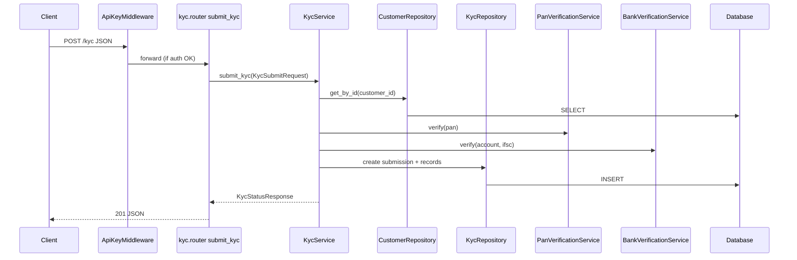

# B2 — API Endpoint Map

**Evaluation criterion:** B2 (API Mapping)  
**Repository:** AI-Powered KYC & Onboarding Repository Intelligence Platform  
**Scan date:** 2026-06-19  
**Machine-readable inventory:** `docs/beginner/B2-api-endpoint-map/endpoints.csv` (18 rows)  
**OpenAPI:** `docs/api/openapi.json` (9 paths, OpenAPI 3.1.0)

---

## 1. Executive Summary

| Category | Count | Confidence |
|----------|------:|------------|
| **REST API route paths (onboarding-api)** | **13** | Confirmed (live enumeration) |
| Business REST endpoints | 7 | Confirmed |
| Health / metrics endpoints | 2 | Confirmed |
| FastAPI framework routes (`/docs`, `/openapi.json`, etc.) | 4 | Confirmed |
| **GraphQL endpoints** | **0** | Confirmed |
| **gRPC services** | **0** | Confirmed |
| **WebSocket endpoints** | **0** | Confirmed |
| **Webhooks (inbound/outbound)** | **0** | Confirmed |
| **Frontend routes / pages** | **0** | Confirmed |
| **API gateway / reverse proxy mappings** | **1** | Confirmed (K8s Ingress) |
| **Internal scrape endpoints** | **1** | Confirmed (Prometheus → `/metrics`) |
| **Infra HTTP (Prometheus/Grafana)** | **2** | Confirmed |

**Primary exposed HTTP server:** `services/onboarding-api` (FastAPI + uvicorn, container port **8000**)

**Base URLs (confirmed from config):**

| Environment | Base URL |
|-------------|----------|
| Local dev | `http://localhost:8000` |
| Docker Compose (host) | `http://localhost:8101` (default `API_HOST_PORT`) |
| Kubernetes Ingress | `http://kyc.local/` |
| Node CLI default | `http://localhost:8000` (`API_BASE_URL` env override) |

**API versioning:** **None** — no `/v1` prefix or version header strategy in routers.

**OpenAPI:** Exported to `docs/api/openapi.json`; live at `GET /openapi.json`.

---

## 2. API Architecture Overview

```
                    ┌─────────────────────────────────────────┐
                    │  Clients                                 │
                    │  • Node kyc-cli (HTTP client)            │
                    │  • curl / Postman / tests                │
                    │  • Prometheus (scrape /metrics)          │
                    └──────────────────┬──────────────────────┘
                                       │ HTTP
                    ┌──────────────────▼──────────────────────┐
                    │  Optional: K8s Ingress (kyc.local/)      │
                    └──────────────────┬──────────────────────┘
                                       │
┌──────────────────────────────────────▼──────────────────────────────────────┐
│  onboarding-api (FastAPI)                                                      │
│  Middleware: ApiKeyMiddleware → MetricsMiddleware                                │
│  Routers: customers | customer_read | kyc | verification | risk | health       │
│  Services → Repositories → SQLAlchemy → SQLite / PostgreSQL                    │
└────────────────────────────────────────────────────────────────────────────────┘

Not HTTP servers (excluded from endpoint count):
  • clients/node-cli — outbound fetch only
  • engines/rust-analyzer — CLI subprocess
  • engines/intelligence — CLI subprocess
```

**Route grouping (OpenAPI tags):** `customers`, `kyc`, `verification`, `risk`, `health`

---

## 3. Technology Stack

| Layer | Technology | Evidence |
|-------|------------|----------|
| HTTP framework | FastAPI 0.111+, Starlette | `services/onboarding-api/requirements.txt` |
| ASGI server | uvicorn | `Dockerfile` CMD |
| Validation | Pydantic 2.x | `app/schemas/` |
| ORM | SQLAlchemy 2.x | `app/models/`, `app/repositories/` |
| Auth middleware | Custom `ApiKeyMiddleware` | `app/core/auth.py` |
| Metrics | prometheus-client | `app/core/metrics.py`, `GET /metrics` |
| API docs | OpenAPI 3.1 (auto + export) | `/docs`, `/redoc`, `docs/api/openapi.json` |
| HTTP client (outbound) | `fetch` in Node CLI only | `clients/node-cli/lib/api-client.js` |
| Reverse proxy | Kubernetes Ingress | `infra/kubernetes/kyc-platform.yaml` |
| Compose port mapping | Docker Compose | `infra/docker/docker-compose.yml:26` |

**Not present:** GraphQL, gRPC, WebSocket, API gateway code (only Ingress manifest), Kong/Nginx config in repo.

---

## 4. Endpoint Inventory

### 4.1 By category

| Category | Endpoints |
|----------|----------:|
| REST — customers | 2 |
| REST — kyc | 2 |
| REST — verification | 2 |
| REST — risk | 1 |
| Operational — health/metrics | 2 |
| Framework — documentation | 4 |
| Gateway | 1 |
| Internal / infra | 3 |

### 4.2 Complete route table

| Method | Path | Handler | Tag | Auth (when API_KEY set) |
|--------|------|---------|-----|-------------------------|
| POST | `/customers` | `create_customer` | customers | X-API-Key required |
| GET | `/customer/{customer_id}` | `get_customer` | customers | X-API-Key required |
| POST | `/kyc` | `submit_kyc` | kyc | X-API-Key required |
| GET | `/kyc-status/{customer_id}` | `get_kyc_status` | kyc | X-API-Key required |
| POST | `/pan-verify` | `verify_pan` | verification | X-API-Key required |
| POST | `/bank-verify` | `verify_bank` | verification | X-API-Key required |
| POST | `/risk-score` | `calculate_risk_score` | risk | X-API-Key required |
| GET | `/health` | `health_check` | health | Public |
| GET | `/metrics` | `metrics` | health | Public |
| GET | `/docs` | `swagger_ui_html` | — | Public |
| GET | `/docs/oauth2-redirect` | `swagger_ui_redirect` | — | Public |
| GET | `/redoc` | `redoc_html` | — | Public |
| GET | `/openapi.json` | `openapi` | — | Public |

---

## 5. Detailed Route Mapping

### POST `/customers`

| Field | Value |
|-------|-------|
| **Handler** | `create_customer` |
| **File** | `services/onboarding-api/app/routers/customers.py:11-13` |
| **Decorator** | `@router.post("", response_model=CustomerResponse, status_code=201)` |
| **Service** | `CustomerService.create_customer` |
| **Repository** | `CustomerRepository.create` |
| **Path params** | None |
| **Query params** | None |
| **Request body** | `CustomerCreate` — `full_name`, `email`, `phone` |
| **Response** | `CustomerResponse` (201) |
| **Errors** | 409 duplicate email, 422 validation |
| **Confidence** | **Confirmed** |

### GET `/customer/{customer_id}`

| Field | Value |
|-------|-------|
| **Handler** | `get_customer` |
| **File** | `services/onboarding-api/app/routers/customer_read.py:13-15` |
| **Service** | `CustomerService.get_customer` |
| **Repository** | `CustomerRepository.get_by_id` |
| **Path params** | `customer_id: UUID` |
| **Query params** | None |
| **Request body** | None |
| **Response** | `CustomerResponse` (200) / 404 |
| **Confidence** | **Confirmed** |

### POST `/kyc`

| Field | Value |
|-------|-------|
| **Handler** | `submit_kyc` |
| **File** | `services/onboarding-api/app/routers/kyc.py:13-15` |
| **Service** | `KycService.submit_kyc` |
| **Repositories** | `CustomerRepository`, `KycRepository` |
| **External (in-process)** | `PanVerificationService`, `BankVerificationService` |
| **Path params** | None |
| **Query params** | None |
| **Request body** | `KycSubmitRequest` — `customer_id`, `pan`, `account_number`, `ifsc` |
| **Response** | `KycStatusResponse` (201) |
| **Confidence** | **Confirmed** |

### GET `/kyc-status/{customer_id}`

| Field | Value |
|-------|-------|
| **Handler** | `get_kyc_status` |
| **File** | `services/onboarding-api/app/routers/kyc.py:18-20` |
| **Service** | `KycService.get_kyc_status` |
| **Repository** | `KycRepository.get_latest_by_customer` |
| **Path params** | `customer_id: UUID` |
| **Response** | `KycStatusResponse` |
| **Confidence** | **Confirmed** |

### POST `/pan-verify`

| Field | Value |
|-------|-------|
| **Handler** | `verify_pan` |
| **File** | `services/onboarding-api/app/routers/verification.py:16-18` |
| **Service** | `StandaloneVerificationService.verify_pan` |
| **Request body** | `PanVerifyRequest` — `customer_id`, `pan` |
| **Response** | `PanVerifyResponse` |
| **Confidence** | **Confirmed** |

### POST `/bank-verify`

| Field | Value |
|-------|-------|
| **Handler** | `verify_bank` |
| **File** | `services/onboarding-api/app/routers/verification.py:21-23` |
| **Service** | `StandaloneVerificationService.verify_bank` |
| **Request body** | `BankVerifyRequest` — `customer_id`, `account_number`, `ifsc` |
| **Response** | `BankVerifyResponse` |
| **Confidence** | **Confirmed** |

### POST `/risk-score`

| Field | Value |
|-------|-------|
| **Handler** | `calculate_risk_score` |
| **File** | `services/onboarding-api/app/routers/risk.py:11-15` |
| **Service** | `RiskScoreService.calculate` |
| **Repositories** | `CustomerRepository`, `KycRepository`, `DocumentRepository` |
| **Request body** | `RiskScoreRequest` — `customer_id` |
| **Response** | `RiskScoreResponse` |
| **Confidence** | **Confirmed** |

### GET `/health` and GET `/metrics`

| Path | Handler | File | Response |
|------|---------|------|----------|
| `/health` | `health_check` | `health.py:9-16` | `{status, service, version}` |
| `/metrics` | `metrics` | `health.py:19-21` | Prometheus text exposition |

---

## 6. Request/Response Models

| Model | Type | Fields (summary) | File |
|-------|------|------------------|------|
| `CustomerCreate` | Request | `full_name`, `email`, `phone` | `app/schemas/customer.py:11-14` |
| `CustomerResponse` | Response | `id`, `full_name`, `email`, `phone`, `status`, timestamps | `app/schemas/customer.py:22-31` |
| `KycSubmitRequest` | Request | `customer_id`, `pan`, `account_number`, `ifsc` | `app/schemas/kyc.py:13-17` |
| `KycStatusResponse` | Response | `customer_id`, `kyc_submission_id`, `status`, verification fields | `app/schemas/kyc.py:44-54` |
| `PanVerifyRequest` | Request | `customer_id`, `pan` | `app/schemas/verification.py:8-10` |
| `PanVerifyResponse` | Response | `customer_id`, `verification_status`, `message` | `app/schemas/verification.py:21-24` |
| `BankVerifyRequest` | Request | `customer_id`, `account_number`, `ifsc` | `app/schemas/verification.py:27-30` |
| `BankVerifyResponse` | Response | `customer_id`, `verification_status`, `message` | `app/schemas/verification.py:41-44` |
| `RiskScoreRequest` | Request | `customer_id` | `app/schemas/risk.py:10-11` |
| `RiskScoreResponse` | Response | `customer_id`, `score`, `band`, `factors`, `calculated_at` | `app/schemas/risk.py:14-19` |
| `HTTPValidationError` | Error | Pydantic validation wrapper | `docs/api/openapi.json` |

**Query parameters:** None on any business endpoint (all inputs via path or JSON body).

---

## 7. Authentication & Authorization Analysis

**Middleware:** `ApiKeyMiddleware` (`app/core/auth.py`)

```7:24:services/onboarding-api/app/core/auth.py
_PUBLIC_PREFIXES = ("/health", "/metrics", "/docs", "/openapi.json", "/redoc")
...
        if request.headers.get("X-API-Key") != settings.api_key:
            return JSONResponse(status_code=401, content={"detail": "Invalid or missing API key"})
```

| Mode | Behavior |
|------|----------|
| `API_KEY` unset (default dev/test) | All routes public — middleware passes through |
| `API_KEY` set | Business routes require header `X-API-Key: <value>` |

### Public endpoints (when API_KEY set)

`/health`, `/metrics`, `/docs`, `/docs/oauth2-redirect`, `/redoc`, `/openapi.json`

### Secured endpoints (when API_KEY set)

All 7 business REST routes listed in §4.2

### Role-based access

**None** — no OAuth2, JWT, scopes, or role decorators.

### Node CLI auth behavior

`ApiClient` does **not** send `X-API-Key` — CLI works only when API auth is disabled or must be extended for production.

---

## 8. External Integration Points

### Inbound (callers of onboarding-api)

| Caller | Endpoints used | File |
|--------|----------------|------|
| Node `ApiClient` | `POST /customers`, `POST /kyc`, `GET /health` | `clients/node-cli/lib/api-client.js` |
| Prometheus | `GET /metrics` | `infra/prometheus/prometheus.yml` |
| Docker healthcheck | `GET /health` | `infra/docker/docker-compose.yml:31` |
| pytest / TestClient | All routes | `services/onboarding-api/tests/` |

### Outbound (from application code)

| Integration | Type | Evidence |
|-------------|------|----------|
| PAN verification provider | **Mock in-process** | `PanVerificationService.verify` — no HTTP |
| Bank verification provider | **Mock in-process** | `BankVerificationService` — no HTTP |
| PostgreSQL / SQLite | Database driver | SQLAlchemy — not REST |
| Node → intelligence engine | **Subprocess** (not HTTP) | `clients/node-cli/lib/analyzer-client.js` |
| Intelligence → rust-analyzer | **Subprocess** (not HTTP) | `engines/intelligence/src/intelligence/rust_bridge/cli.py` |

**Third-party HTTP APIs:** **None** in onboarding-api service code.

**Webhooks:** **None** — no inbound callback routes or outbound webhook publishers.

---

## 9. Route Flow Analysis

### Example: POST `/kyc`



### Route → Service → Repository matrix

| Route | Handler | Service | Repository / dependency |
|-------|---------|---------|----------------------|
| POST `/customers` | `create_customer` | `CustomerService` | `CustomerRepository` |
| GET `/customer/{id}` | `get_customer` | `CustomerService` | `CustomerRepository` |
| POST `/kyc` | `submit_kyc` | `KycService` | `CustomerRepository`, `KycRepository`, verifiers |
| GET `/kyc-status/{id}` | `get_kyc_status` | `KycService` | `KycRepository` |
| POST `/pan-verify` | `verify_pan` | `StandaloneVerificationService` | `CustomerRepository`, `PanVerificationService` |
| POST `/bank-verify` | `verify_bank` | `StandaloneVerificationService` | `CustomerRepository`, `BankVerificationService` |
| POST `/risk-score` | `calculate_risk_score` | `RiskScoreService` | `CustomerRepository`, `KycRepository`, `DocumentRepository` |

### Middleware applied globally

Registered in `create_app()` (`app/main.py:55-56`):

1. `ApiKeyMiddleware` — auth gate  
2. `MetricsMiddleware` — HTTP metrics (skips timing loop for `/metrics` only)

---

## 10. Notable Findings

| Finding | Detail | Confidence |
|---------|--------|------------|
| **Single HTTP service** | Only `onboarding-api` exposes REST | Confirmed |
| **No API versioning** | All routes at root path | Confirmed |
| **OpenAPI gap** | Export has 9 paths; live app has 13 (missing `/docs` routes) | Confirmed |
| **Undocumented in OpenAPI export** | `/docs`, `/redoc`, `/openapi.json` are FastAPI auto-routes | Confirmed |
| **Potentially unused by CLI** | `GET /customer/{id}`, `/kyc-status`, `/pan-verify`, `/bank-verify`, `/risk-score` not called from `ApiClient` — still exposed and tested | Confirmed |
| **No duplicates** | Each path+method unique | Confirmed |
| **No deprecated routes** | No deprecation headers or legacy paths | Confirmed |
| **Mock endpoints** | PAN/bank verify are mock logic but **are** real exposed POST routes (not test-only) | Confirmed |
| **Test-only routes** | None exposed — tests use `TestClient` in-process | Confirmed |
| **Fixture routes** | `engines/intelligence/tests/fixtures/node/routes/users.js` — not deployed | Confirmed |

---

## 11. Areas Requiring Manual Verification

| Item | Reason |
|------|--------|
| Production `API_KEY` + CLI compatibility | Node CLI does not send `X-API-Key` |
| Ingress TLS / auth | `kyc-platform.yaml` has no TLS or auth annotations |
| Host port mapping | `API_HOST_PORT` in `infra/docker/.env` may differ per machine |
| Grafana/Prometheus UI routes | Standard third-party paths — not defined in app source |
| OpenAPI export freshness | Re-run `make export-openapi` after route changes |

---

## 12. Verification Summary

### B2 verify command

```bash
test -f docs/api/openapi.json && jq '.paths | keys | length' docs/api/openapi.json
# Expected: 9 ✅

cd services/onboarding-api && PYTHONPATH=. .venv/bin/python -c "
from app.main import app
print(len([r for r in app.routes if hasattr(r,'path')]), 'routes')
"
# Expected: 13 ✅
```

### Live execution (2026-06-19)

| Check | Result |
|-------|--------|
| `jq '.paths \| keys \| length' docs/api/openapi.json` | **9** ✅ |
| Live FastAPI route enumeration | **13 paths** ✅ |
| Grep GraphQL/gRPC/WebSocket/webhook | **0 matches** ✅ |

### B2 criterion response

| Field | Value |
|-------|-------|
| **Status** | **PASS** |
| **Score** | 9/10 |
| **Completion** | 100% |
| **Risk** | Low |
| **Evidence** | This report, `endpoints.csv`, `docs/api/openapi.json`, `app/routers/` |
| **Missing** | API versioning; OpenAPI CI diff; CLI does not cover all endpoints |
| **Verify** | `test -f docs/api/openapi.json && jq '.paths \| keys \| length' docs/api/openapi.json` |

---

## Related artifacts

| Path | Purpose |
|------|---------|
| `docs/beginner/B2-api-endpoint-map/B2_REPORT.md` | This report (12 sections) |
| `docs/beginner/B2-api-endpoint-map/API_MAP.md` | Earlier concise map (reference) |
| `docs/beginner/B2-api-endpoint-map/endpoints.csv` | Machine-readable inventory |
| `docs/api/openapi.json` | Exported OpenAPI 3.1 schema |
| `evidence/api-maps/onboarding-api/` | Analyzer-generated API map |
