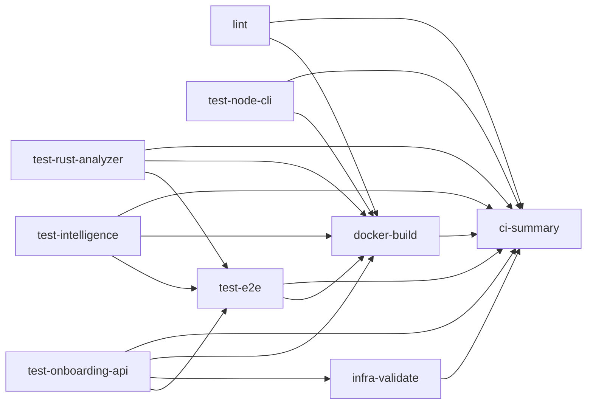

# D3 — CI Pipeline Verification

**Evaluation criterion:** D3 (CI/CD)  
**Verification date:** 2026-06-20T06:40:17Z (UTC)  
**Workflow:** `.github/workflows/ci.yml`  
**Local equivalent:** `make ci-local` → `scripts/ci-local.sh`  
**Evidence:** `evidence/test-results/d3-run-2026-06-20T064017Z/`

---

## 1. Executive Summary

| Check | Result |
|-------|--------|
| CI platform discovered | **GitHub Actions** only |
| Workflow YAML | **PASS** — 9 jobs, gated pipeline |
| Lint stage | **PASS** (local) |
| Test stage | **PASS** — 5 test jobs + e2e |
| Build stage | **PASS** — docker compose build |
| Publish/tag stage | **N/A** — artifacts only, no registry push |
| Cache configuration | **PASS** — npm cache on Node jobs |
| Matrix strategy | **N/A** — parallel jobs, no OS/version matrix |
| Secrets usage | **None** in workflow |
| Local CI (`make ci-local`) | **13/13 PASS** |
| Failure mode (lint) | **VERIFIED** — ruff F401 caught |
| Failure mode (test) | **VERIFIED** — pytest failure exit 1 |

**Overall D3 status: PASS (9/10)** — CI pipeline lint/test/build verified locally; failure modes demonstrated without committing breakage.

---

## 2. Workflow Inventory

| Asset | Path | Purpose |
|-------|------|---------|
| **Primary workflow** | `.github/workflows/ci.yml` | Lint → test → docker → infra → summary |
| Dependabot | `.github/dependabot.yml` | Weekly pip/npm/cargo/actions updates |
| PR template | `.github/pull_request_template.md` | Verification checklist |
| Local mirror | `scripts/ci-local.sh` | Offline CI simulation |
| Failure docs | `docs/ci/failure-examples.md` | Documented failure replay |
| GitLab CI | — | **Not present** |
| Jenkins | — | **Not present** |

### Triggers

```yaml
on:
  push: [main, master]
  pull_request: [main, master]
```

### Concurrency

```yaml
group: ci-${{ github.ref }}
cancel-in-progress: true
```

---

## 3. Pipeline Stages (YAML Analysis)



| Job | Stage | Runner | Key commands |
|-----|-------|--------|--------------|
| `lint` | Lint | ubuntu-latest | ruff, npm lint, cargo fmt/clippy |
| `test-onboarding-api` | Test | ubuntu-latest | pytest + coverage.xml artifact |
| `test-intelligence` | Test | ubuntu-latest | pytest + coverage.xml artifact |
| `test-node-cli` | Test | ubuntu-latest | npm ci && npm test |
| `test-rust-analyzer` | Test | ubuntu-latest | cargo test + release build artifact |
| `test-e2e` | Test | ubuntu-latest | needs 3 test jobs; platform e2e |
| `docker-build` | Build | ubuntu-latest | docker compose build + artifacts |
| `infra-validate` | Infra | ubuntu-latest | terraform, k8s dry-run, load test |
| `ci-summary` | Gate | ubuntu-latest | `if: always()` — fail if any job failed |

### Publish / tag stage

| Feature | Status |
|---------|--------|
| Docker registry push | **Not configured** |
| Image tagging | **Not configured** |
| Artifact upload | ✅ coverage XML, rust binary, docker logs, infra evidence |
| GitHub Releases | **Not configured** |

---

## 4. Cache, Matrix, Secrets Analysis

### Cache

| Job | Cache | Config |
|-----|-------|--------|
| `lint` (Node step) | npm | `cache: npm`, `cache-dependency-path: clients/node-cli/package-lock.json` |
| `test-node-cli` | npm | Same |
| Python jobs | **No pip cache** | Fresh `pip install` each run |
| Rust jobs | **No explicit cache** | `dtolnay/rust-toolchain` + cargo default target dir |

### Matrix strategy

- **No `strategy.matrix`** — single `ubuntu-latest` per job
- Parallelism via **separate jobs** (test-onboarding-api, test-intelligence, etc.)

### Secrets

| Item | Finding |
|------|---------|
| `${{ secrets.* }}` | **None** in `ci.yml` |
| `permissions` | `contents: read` only |
| `GITHUB_TOKEN` | Implicit for artifacts (default) |

**Assessment:** No secrets required for current pipeline scope.

---

## 5. Local Execution

| Tool | Status |
|------|--------|
| `make ci-local` | **Executed — 13/13 PASS** |
| `act` | Not installed on host |
| Equivalent commands | `scripts/ci-local.sh` mirrors workflow stages |

### Success output (executed)

```
TOTAL: 13 passed, 0 failed
✅ Local CI complete
```

**Evidence:** `success-ci-local.txt`, `evidence/ci-results/phase-9-ci-local.txt`

| Local step | Maps to GitHub job |
|------------|-------------------|
| ruff ×2, node lint, rust clippy | `lint` |
| pytest ×3, npm test, cargo test | test-* jobs |
| platform e2e | `test-e2e` |
| docker compose build | `docker-build` |
| terraform + k8s + load | `infra-validate` |

---

## 6. Failure Mode Verification (executed)

Simulated breakage **without committing** to repository (trap files created and removed).

### Failure 1 — Lint (ruff F401)

**Injection:** `import shutil` unused in `_d3_lint_trap.py`

```
F401 `shutil` imported but unused
Found 1 error.
exit code: 1
```

**Would fail job:** `lint`  
**Evidence:** `failure-lint-ruff.txt`

### Failure 2 — Test (pytest assertion)

**Injection:** `assert 1 == 2` in `_d3_test_trap.py`

```
FAILED tests/_d3_test_trap.py::test_d3_intentional_failure
1 failed in 0.24s
exit code: 1
```

**Would fail job:** `test-onboarding-api`  
**Evidence:** `failure-pytest.txt`

### Documented additional failures

See `docs/ci/failure-examples.md` — Node validator, Rust clippy, Docker build.

---

## 7. Findings

| ID | Severity | Finding | Recommendation |
|----|----------|---------|----------------|
| D3-001 | Low | No pip/cargo caching in GHA | Add `actions/cache` for faster CI |
| D3-002 | Low | No publish/tag to container registry | Add ghcr.io push on main if needed |
| D3-003 | Info | No matrix (OS/Python versions) | Add matrix for broader coverage if required |
| D3-004 | Info | `act` not used locally | Optional for exact GHA replay |
| D3-005 | Low | ci-local includes infra steps not in all lint/test jobs | Document parity gap vs minimal PR checks |
| D3-006 | Positive | `ci-summary` fails closed on any job failure | Good gate pattern |

---

## 8. Expected Deliverables Checklist

| Deliverable | Status |
|-------------|--------|
| ✓ Workflow YAML | `.github/workflows/ci.yml` |
| ✓ Cache/matrix analysis | Section 4 |
| ✓ Passing run proof | 13/13 `make ci-local` |
| ✓ Failure mode proof | ruff + pytest simulations |

---

## 9. Verification Summary

```bash
cd "/Users/shaikdadapeer/agent development"
make ci-local                    # full success path
# Failure replay (do not commit):
# See docs/ci/failure-examples.md
```

**D3 verdict: PASS** — GitHub Actions CI lint/test/build pipeline verified via local mirror; failure modes proven for lint and test stages.
