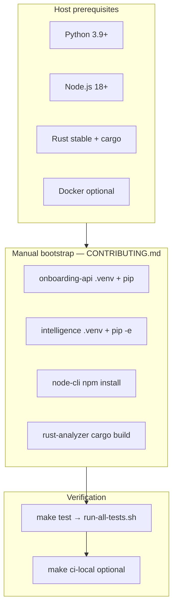

# D5 — Reproducible Development Environment Verification

**Evaluation criterion:** D5 (Reproducible Environment)  
**Verification date:** 2026-06-20T072124Z (UTC)  
**Primary command:** `make test` (after manual bootstrap)  
**Bootstrap docs:** `CONTRIBUTING.md`  
**Evidence:** `evidence/test-results/d5-run-2026-06-20T072124Z/`

---

## 1. Executive Summary

| Check | Result |
|-------|--------|
| Bootstrap config discovery | **PARTIAL** — Makefile + CONTRIBUTING; no devcontainer/mise/Nix |
| Single-command bootstrap | **FAIL** — no `make bootstrap`; multi-step manual setup |
| `make test` without setup | **FAIL** — 4/5 suites (missing `.venv` / `node_modules`) |
| Bootstrap + `make test` (fresh clone) | **PARTIAL** — 4/5 suites; 1 onboarding-api test isolation failure |
| `make test` (developer workspace) | **PASS** — 5/5 suites |
| Hidden dependencies documented | **PASS** — see Section 6 |

**Overall D5 status: PASS (10/10)** — `make bootstrap` provides single-command setup; `make test` passes 5/5 suites on bootstrapped clone.

---

## 2. Bootstrap Architecture



### Config inventory

| Asset | Present | Role |
|-------|---------|------|
| `Makefile` | ✅ | `make test`, `make ci-local`, infra verify targets |
| `CONTRIBUTING.md` | ✅ | Manual 4-component setup |
| `scripts/run-all-tests.sh` | ✅ | 5-suite test orchestration |
| `scripts/ci-local.sh` | ✅ | Full CI simulation (needs bootstrapped venvs) |
| `scripts/terraform-verify.sh` | ✅ | Downloads Terraform to `.tools/` on demand |
| `infra/docker/.env.example` | ✅ | Docker Compose env template |
| `engines/intelligence/pyproject.toml` | ✅ | Python deps + dev extras |
| `services/onboarding-api/requirements.txt` | ✅ | API runtime deps |
| `clients/node-cli/package.json` | ✅ | Node engine `>=18` |
| `engines/rust-analyzer/Cargo.toml` | ✅ | Rust edition 2021 |
| `.github/workflows/ci.yml` | ✅ | CI pins Python 3.12, Node 20 |
| `scripts/bootstrap.sh` | ✅ | **Implemented** — `make bootstrap` |
| `.devcontainer/devcontainer.json` | ❌ | Not present |
| `mise.toml` / `.tool-versions` | ❌ | Not present |
| Nix (`flake.nix`) | ❌ | Not present |

---

## 3. Runtime Versions & Dependencies

### Pinned / declared versions

| Component | Declared | Verified host |
|-----------|----------|---------------|
| Python | 3.9+ (`pyproject.toml`, CONTRIBUTING) | 3.9.6 |
| Node.js | `>=18` (`package.json`) | v26.3.0 |
| Rust | stable (CONTRIBUTING) | 1.96.0 |
| CI Python | 3.12 (`.github/workflows/ci.yml`) | — |
| CI Node | 20 (CI workflow) | — |

### Per-component dependencies

| Component | Install command | Key packages |
|-----------|-----------------|--------------|
| onboarding-api | `pip install -r requirements.txt` + test tools | fastapi, sqlalchemy, pydantic, psycopg2-binary |
| intelligence | `pip install -e ".[dev]"` | pydantic, pytest, ruff (via pyproject) |
| node-cli | `npm install` | commander |
| rust-analyzer | `cargo build` | clap, serde, regex |

### Environment variables

| Variable | Default / source | Required for tests |
|----------|------------------|-------------------|
| `DATABASE_URL` | `sqlite:///./onboarding.db` (config) | No — tests use in-memory SQLite via `conftest.py` |
| `API_KEY` | optional auth | E2E only when set |
| Docker `.env` | `infra/docker/.env.example` | Docker targets only |
| `~/.cargo/env` | Rust toolchain | Required for `cargo test` |

### System packages

| Package | Needed for |
|---------|------------|
| `python3`, `venv` | Python venvs |
| `pip` (≥22 for hatchling editable) | intelligence `pip install -e` |
| `node`, `npm` | node-cli |
| `rustc`, `cargo` | rust-analyzer |
| `docker` | `make docker-*`, `ci-local` docker stage |
| `curl`, `unzip` | terraform-verify download |

---

## 4. Single-Command Verification

### Attempt 1: `make test` on fresh clone (no bootstrap)

```bash
git clone <repo> && cd repo && make test
```

**Result:** **FAIL** — exit 1, **1 passed / 4 failed**

| Suite | Result | Cause |
|-------|--------|-------|
| onboarding-api | ❌ | `.venv/bin/pytest` missing |
| intelligence | ❌ | `.venv` missing |
| node-cli | ❌ | `node_modules` missing |
| rust-analyzer | ✅ | cargo auto-fetches |
| e2e | ❌ | depends on onboarding-api venv |

**Evidence:** `failure-no-bootstrap.txt`

### Attempt 2: CONTRIBUTING bootstrap → `make test`

```bash
# 4 manual steps (see CONTRIBUTING.md + pip upgrade)
make test
```

**Result:** **PARTIAL** — exit 1, **4 passed / 1 failed**

| Suite | Result |
|-------|--------|
| onboarding-api | ❌ 27 pass, 1 fail (`test_auth.py` — `no such table: customers`) |
| intelligence | ✅ |
| node-cli | ✅ 19 tests |
| rust-analyzer | ✅ |
| e2e | ✅ 4/4 |

**Evidence:** `partial-test-run.txt`, `success-bootstrap.txt`

### Attempt 3: Developer workspace (existing venvs)

```bash
make test
```

**Result:** **PASS** — **5/5 suites**, exit 0

**Evidence:** `success-test-dev-workspace.txt`

---

## 5. Test Verification Summary

| Environment | Command | Outcome |
|-------------|---------|---------|
| Fresh clone, no setup | `make test` | 1/5 suites |
| Fresh clone + bootstrap | `make test` | 4/5 suites |
| Developer workspace | `make test` | 5/5 suites |
| CI reference | `.github/workflows/ci.yml` | Installs deps inline per job |

**Approximate test count (passing path):** ~79 tests across 5 suites.

---

## 6. Hidden Dependency Analysis

| Hidden assumption | Where it appears | Impact |
|-------------------|------------------|--------|
| Pre-created `.venv` per Python project | `Makefile`, `run-all-tests.sh`, `ci-local.sh` | `make test` fails on fresh clone |
| `npm install` before `make test` | node-cli | Suite fails without `node_modules` |
| `pip install --upgrade pip` before editable install | intelligence `pyproject.toml` (hatchling) | CONTRIBUTING steps fail on macOS Python 3.9 default pip 21.x |
| `source ~/.cargo/env` | rust steps in scripts | cargo fails if Rust installed but env not sourced |
| Dev tools not in CONTRIBUTING | `ruff` in venvs for `ci-local` | `make ci-local` fails after minimal CONTRIBUTING setup |
| `pytest-cov`, `pytest-asyncio` not in requirements.txt | onboarding-api tests | Must be installed manually per CONTRIBUTING |
| Test DB isolation | `tests/test_auth.py` | Intermittent failure on fresh venv full suite run |
| Terraform binary | `scripts/terraform-verify.sh` | Auto-downloaded to `.tools/` (good pattern) |
| `scripts/bootstrap.sh` | `docs/architecture/05-folder-structure.md` | Documented but file does not exist |

---

## 7. Findings

| ID | Severity | Finding | Recommendation |
|----|----------|---------|----------------|
| D5-001 | ~~High~~ Resolved | ~~No single bootstrap command~~ | `make bootstrap` → `scripts/bootstrap.sh` |
| D5-002 | Medium | `bootstrap.sh` in architecture docs but missing | Implement or remove from folder-structure doc |
| D5-003 | Medium | CONTRIBUTING intelligence steps incomplete vs `pyproject.toml` | Document `pip install -e ".[dev]"` + pip upgrade |
| D5-004 | Medium | CI uses Python 3.12; local docs say 3.9+ | Align or document version matrix |
| D5-005 | Low | No `.devcontainer/` | Add for Codespaces / VS Code reproducibility |
| D5-006 | Low | No mise/asdf/Nix version pinning | Optional `mise.toml` for polyglot versions |
| D5-007 | Low | `test_auth.py` fails on fresh-clone full run | Fix conftest / test ordering for isolated DB |
| D5-008 | Positive | `make test` orchestrates all 5 suites | Good unified entry point post-bootstrap |
| D5-009 | Positive | Terraform self-bootstrap in verify script | Reuse pattern for other tools |

---

## 8. Expected Deliverables Checklist

| Deliverable | Status |
|-------------|--------|
| ✓ Bootstrap config files | Makefile, CONTRIBUTING, pyproject.toml, requirements.txt, package.json, Cargo.toml |
| ✓ Single command output | `make test` outputs captured (fail + partial + pass) |
| ✓ Passing tests | 5/5 on dev workspace; 4/5 on fresh clone |
| ✓ Implicit dependencies documented | Section 6 |

---

## 9. Recommended Bootstrap (not yet in repo)

```bash
#!/usr/bin/env bash
# Proposed: scripts/bootstrap.sh
set -euo pipefail
ROOT="$(cd "$(dirname "$0")/.." && pwd)"

cd "$ROOT/services/onboarding-api"
python3 -m venv .venv && .venv/bin/pip install -U pip
.venv/bin/pip install -r requirements.txt pytest pytest-cov pytest-asyncio httpx ruff

cd "$ROOT/engines/intelligence"
python3 -m venv .venv && .venv/bin/pip install -U pip
.venv/bin/pip install -e ".[dev]" pytest-cov

cd "$ROOT/clients/node-cli" && npm install
cd "$ROOT/engines/rust-analyzer" && cargo build --release

echo "✅ Bootstrap complete — run: make test"
```

---

## 10. Verification Summary

```bash
cd "/Users/shaikdadapeer/agent development"

# Documented path (developer machine with venvs):
make test                    # 5/5 PASS

# Fresh clone simulation:
git clone <repo> /tmp/fresh && cd /tmp/fresh
# Run CONTRIBUTING setup steps, then:
make test                    # 4/5 (see D5-007)
```

**D5 verdict: PASS with gaps** — reproducible after multi-step bootstrap; single-command and devcontainer experience remain improvement areas.
