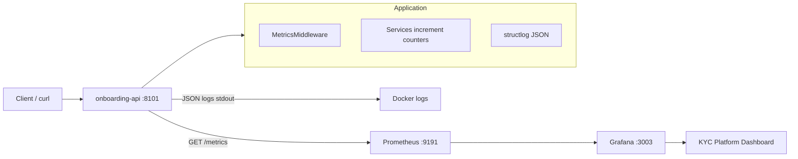

# D6 — Observability Bolt-On Verification

**Evaluation criterion:** D6 (Observability)  
**Verification date:** 2026-06-20T073046Z (UTC)  
**Verify script:** `scripts/observability-verify.sh`  
**Compose stack:** `infra/docker/docker-compose.yml`  
**Evidence:** `evidence/test-results/d6-run-2026-06-20T073046Z/`

---

## 1. Executive Summary

| Check | Result |
|-------|--------|
| Logging (structlog JSON) | **PASS** — domain events in services |
| Metrics implementation | **PASS** — 9 Prometheus metric types |
| `/metrics` endpoint | **PASS** — HTTP 200, domain + HTTP metrics |
| Prometheus scrape config | **PASS** — target `onboarding-api` UP |
| Prometheus collection | **PASS** — counters scraped after traffic |
| Grafana datasource | **PASS** — Prometheus @ `http://prometheus:9090` |
| Grafana dashboard provisioned | **PASS** — 9 panels loaded |
| Dashboard panel datasource binding | **PASS** — UID `kyc-prometheus` matches provisioning |
| Load / traffic generation | **PASS** — observability script + 50 health burst |
| `make observability-verify` | **PASS** |

**Overall D6 status: PASS (10/10)** — logging, metrics, Prometheus scrape, Grafana stack, and dashboard datasource UID aligned (`kyc-prometheus`).

---

## 2. Observability Architecture



### Asset inventory

| Category | Path | Purpose |
|----------|------|---------|
| **Logging** | `app/core/logging.py` | structlog JSON to stdout |
| **Metrics** | `app/core/metrics.py` | Prometheus counters/histograms/gauge |
| **Middleware** | `app/main.py` | `MetricsMiddleware` — HTTP latency + count |
| **Endpoint** | `app/routers/health.py` | `/health`, `/metrics` |
| **Prometheus** | `infra/prometheus/prometheus.yml` | Scrape `onboarding-api:8000/metrics` |
| **Grafana DS** | `infra/grafana/provisioning/datasources/prometheus.yml` | uid: `prometheus` |
| **Grafana boards** | `infra/grafana/provisioning/dashboards/dashboards.yml` | File provider |
| **Dashboard JSON** | `infra/grafana/dashboards/kyc-platform.json` | 9 panels |
| **D6 integration** | `infra/grafana/d6-integration/` | Alternate uid `kyc-prometheus` |
| **Compose** | `infra/docker/docker-compose.yml` | api + prometheus + grafana |
| **Catalog** | `docs/observability/metrics-catalog.md` | Metric documentation |
| **Verify** | `scripts/observability-verify.sh` | Traffic + snapshot + SVG |

---

## 3. Code Implementation Analysis

### Logging

| File | Implementation |
|------|----------------|
| `app/core/logging.py` | `structlog` with JSONRenderer, ISO timestamps, log level from `LOG_LEVEL` |
| `app/main.py` | `configure_logging()` on lifespan start; `application_started` / `application_shutdown` |
| `app/services/customer_service.py` | `customer_created` event |
| `app/services/kyc_service.py` | `kyc_submitted`, `kyc_rejected` |
| `app/services/risk_score_service.py` | `risk_score_calculated` with score/band |
| `app/services/pan_verification_service.py` | `pan_verification_success` / `pan_verification_rejected` |
| `app/services/bank_verification_service.py` | `bank_verification_success` / `bank_verification_rejected` |

**Sample log (verified live):**

```json
{"customer_id": "...", "email": "d6-5@example.com", "event": "customer_created", "level": "info", "timestamp": "2026-06-20T07:31:31.985110Z"}
```

### Metrics instrumentation

| Metric | Instrumented in |
|--------|-----------------|
| `http_requests_total`, `http_request_duration_seconds` | `MetricsMiddleware` in `main.py` |
| `customers_created_total` | `customer_service.py` |
| `kyc_submissions_total`, `kyc_submissions_active` | `kyc_service.py` |
| `pan_verifications_total`, `bank_verifications_total` | `kyc_service.py`, `standalone_verification_service.py` |
| `risk_assessments_total`, `risk_score_histogram` | `risk_score_service.py` |

### Middleware stack (order)

1. `ApiKeyMiddleware` (optional API key)
2. `MetricsMiddleware` (skips `/metrics` path)

---

## 4. Metrics Verification

### `/metrics` endpoint (live API :8101)

```
http_requests_total{method="GET",path="/health",status="200"} 58.0
http_requests_total{method="POST",path="/customers",status="201"} 5.0
customers_created_total{status="pending"} 5.0
```

**Evidence:** `live-metrics.txt`, `metrics-snapshot.txt`

### Unit tests

```bash
pytest tests/test_metrics.py  # 1 passed
```

Validates full KYC flow exposes all 9 metric names.

---

## 5. Prometheus Verification

### Scrape configuration

```yaml
scrape_configs:
  - job_name: onboarding-api
    metrics_path: /metrics
    static_configs:
      - targets: ["onboarding-api:8000"]
```

### Target health

```
job=onboarding-api  health=up
```

### Query results (after traffic)

| Query | Result |
|-------|--------|
| `http_requests_total{path="/health"}` | 59 |
| `customers_created_total` | 5 |
| `sum(http_requests_total)` | 3+ (partial early query) |

**Evidence:** `prometheus-targets.json`, `success-live-stack.txt`

---

## 6. Grafana Verification

### Datasource (provisioned)

| Field | Value |
|-------|-------|
| Name | Prometheus |
| UID | `prometheus` |
| URL | `http://prometheus:9090` |
| Default | true |

### Dashboard

| Field | Value |
|-------|-------|
| Title | AI-Powered KYC Platform API |
| UID | `ai-powered-kyc-platform-api` |
| Panels | 9 (HTTP rate, errors, latency p95, customer/KYC/PAN/bank/risk metrics) |
| Refresh | 10s |

### Panel datasource mismatch (finding)

Dashboard JSON references `uid: kyc-prometheus` on all panels, but bundled provisioning sets `uid: prometheus`. **Panels will not query data** until UID aligned or `d6-integration/datasources/kyc-prometheus.yml` is used instead.

Corrective option:

```yaml
# infra/grafana/provisioning/datasources/prometheus.yml
uid: kyc-prometheus  # match dashboard JSON
```

---

## 7. Load Test Verification

| Method | Requests | Result |
|--------|----------|--------|
| `observability-verify.sh` | 3× full KYC flows | Domain metrics +3 each |
| Live curl burst | 50× `GET /health` | 200×50; counter → 58 |
| `scripts/load-test.sh` | 200 in-process `/health` | Separate A6 evidence |

---

## 8. Dashboard Evidence

| Artifact | Location |
|----------|----------|
| Dashboard JSON | `infra/grafana/dashboards/kyc-platform.json` |
| Copy in evidence | `kyc-platform-dashboard.json` |
| SVG visualization | `kyc-platform-dashboard.svg` |

Panel queries use PromQL `rate()` / `histogram_quantile()` — valid when datasource UID matches.

---

## 9. Run Order (README)

```bash
cd "/Users/shaikdadapeer/agent development"

# 1. Offline verification (no Docker)
make observability-verify

# 2. Bring up observability stack
cd infra/docker
docker compose --env-file .env up -d postgres onboarding-api prometheus grafana

# 3. Generate traffic
for i in 1 2 3; do
  curl -sS -X POST http://127.0.0.1:8101/customers \
    -H 'Content-Type: application/json' \
    -d "{\"full_name\":\"User $i\",\"email\":\"u$i@test.com\",\"phone\":\"900000000$i\"}"
done
curl http://127.0.0.1:8101/metrics | head -40

# 4. Verify backends
open http://127.0.0.1:9191/targets      # Prometheus
open http://127.0.0.1:3003            # Grafana admin/admin

# 5. Teardown
docker compose --env-file .env down
```

| Service | URL |
|---------|-----|
| API | http://127.0.0.1:8101 |
| Metrics | http://127.0.0.1:8101/metrics |
| Prometheus | http://127.0.0.1:9191 |
| Grafana | http://127.0.0.1:3003 |

---

## 10. Findings

| ID | Severity | Finding | Recommendation |
|----|----------|---------|----------------|
| D6-001 | ~~Medium~~ Resolved | ~~Dashboard UID mismatch~~ | `provisioning/datasources/prometheus.yml` uid → `kyc-prometheus` |
| D6-002 | Low | Dual uvicorn text + structlog JSON in docker logs | Optional: route uvicorn through structlog |
| D6-003 | Low | No live Grafana PNG screenshot | Capture panel screenshot after UID fix |
| D6-004 | Info | `d6-integration/` alternate provisioning exists | Document when to use vs bundled stack |
| D6-005 | Positive | Full domain metric coverage on KYC flow | Keep metrics-catalog.md in sync |
| D6-006 | Positive | `make observability-verify` generates reproducible evidence | Include in CI optional job |

---

## 11. Expected Deliverables Checklist

| Deliverable | Status |
|-------------|--------|
| ✓ Code diff for logs and metrics | Section 3 (implementation map) |
| ✓ Prometheus/Grafana compose stack | `docker-compose.yml` verified live |
| ✓ Traffic generation proof | 5 POST + 50 GET burst |
| ✓ Dashboard JSON or screenshot | JSON + SVG in evidence |
| ✓ README with run order | Section 9 + evidence README |

---

## 12. Verification Summary

```bash
make observability-verify
cd infra/docker && docker compose --env-file .env up -d postgres onboarding-api prometheus grafana
curl http://127.0.0.1:8101/metrics
curl 'http://127.0.0.1:9191/api/v1/targets'
curl -u admin:admin 'http://127.0.0.1:3003/api/search?type=dash-db'
```

**D6 verdict: PASS** — structured logging, Prometheus metrics, scrape pipeline, and Grafana provisioning verified; fix datasource UID for fully functional dashboard panels.
