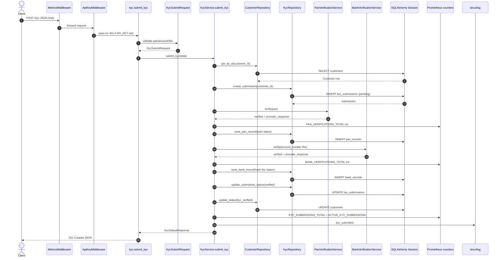

# I2 — End-to-End Flow Trace

**Evaluation criterion:** I2 (E2E Flow Trace)  
**Selected flow:** `POST /kyc` — complete KYC submission  
**Service:** `services/onboarding-api/`  
**Verification date:** 2026-06-20T05:22:00Z (UTC)  
**Evidence:** `evidence/test-results/i2-run-2026-06-20-1052/`  
**Machine-readable:** `flow-steps.csv`, `sequence-diagram.mmd`

---

## 1. Executive Summary

| Finding | Result | Confidence |
|---------|--------|------------|
| Candidate flows discovered | **9 REST endpoints**, **3 CLI commands**, **2 Rust CLI subcommands** | High |
| Selected trace | **`POST /kyc`** — multi-layer business flow | High |
| Entry point | `submit_kyc` in `app/routers/kyc.py:13-15` | High — verified |
| Layers traversed | Middleware → Router → Pydantic → Service → External verifiers → Repository → DB | High — verified |
| External dependencies | SQL DB (SQLite/Postgres), mock PAN/bank providers (in-process) | High |
| Queues / async workers | **None** in this flow | High — confirmed |
| Test evidence | **7/7 PASS** (`test_integration`, `test_kyc`) | High — executed |
| Auto-generated flow artifact gaps | Prior `post-kyc.mmd` omits Pan/Bank services | High — compared to source |

**Overall I2 status: PASS** — complete synchronous flow traced from HTTP entry to final DB writes and metrics.

---

## 2. Selected Flow Overview

### Why `POST /kyc`

| Criterion | `POST /kyc` | Alternatives |
|-----------|-------------|--------------|
| Business significance | Core KYC onboarding | `/health` — ops only |
| Layer depth | Router → Service → 2 external services → 2 repos → 4 tables | `/pan-verify` — standalone, no submission |
| Side effects | 4 INSERT/UPDATE cycles + metrics + logs | CLI — outbound client only |
| Test coverage | Dedicated integration + unit tests | Rust `scan` — no DB |

### Flow summary

A client submits PAN and bank details for an existing customer. The API validates input, confirms the customer exists, creates a `kyc_submissions` row, runs mock PAN and bank verification, persists `pan_records` and `bank_records`, marks the submission and customer as verified, increments Prometheus counters, logs structured events, and returns `201` with `KycStatusResponse`.

### Request / response contract

**Request** (`KycSubmitRequest` — `app/schemas/kyc.py:13-41`):

| Field | Validation |
|-------|------------|
| `customer_id` | UUID |
| `pan` | 10 chars, `PAN_PATTERN` |
| `account_number` | 9–18 numeric digits |
| `ifsc` | 11 chars, `IFSC_PATTERN` |

**Response** (`KycStatusResponse` — `app/schemas/kyc.py:44-54`): `customer_id`, `kyc_submission_id`, `status`, verification statuses, timestamps.

---

## 3. Entry Point Analysis

| Item | Value | Source |
|------|-------|--------|
| **Type** | REST API endpoint | — |
| **Method / path** | `POST /kyc` | `app/routers/kyc.py:13` |
| **Handler** | `submit_kyc` | `app/routers/kyc.py:14-15` |
| **Router registration** | `app.include_router(kyc.router)` | `app/main.py:60` |
| **Status code** | `201 Created` | `app/routers/kyc.py:13` |
| **DB session** | `Depends(get_db)` | `app/routers/kyc.py:14`, `app/core/database.py:16-21` |

### Pre-handler pipeline (verified)

1. **MetricsMiddleware** — records `http_requests_total`, `http_request_duration_seconds` (`app/main.py:22-35,56`)
2. **ApiKeyMiddleware** — optional `X-API-Key` when `API_KEY` env set (`app/core/auth.py:10-24`)
3. **FastAPI + Pydantic** — body parsed into `KycSubmitRequest` before handler runs

---

## 4. Step-by-Step Trace

| Step | Layer | File | Function | Purpose | Input | Output |
|------|-------|------|----------|---------|-------|--------|
| 1 | Middleware | `app/main.py` | `MetricsMiddleware.dispatch` | Request timing/metrics | `Request` | `Response` |
| 2 | Middleware | `app/core/auth.py` | `ApiKeyMiddleware.dispatch` | Auth gate (optional) | Headers | Pass or 401 |
| 3 | Validation | `app/schemas/kyc.py` | `KycSubmitRequest` validators | PAN/IFSC/account rules | JSON body | DTO or 422 |
| 4 | Router | `app/routers/kyc.py` | `submit_kyc` | HTTP entry | `KycSubmitRequest`, `Session` | Delegates to service |
| 5 | Service | `app/services/kyc_service.py` | `KycService.submit_kyc` | Orchestration | `KycSubmitRequest` | `KycStatusResponse` |
| 6 | Repository | `app/repositories/customer_repository.py` | `get_by_id` | Customer lookup | `customer_id` | `Customer` or 404 |
| 7 | Repository | `app/repositories/kyc_repository.py` | `create_submission` | Start submission | `customer_id` | `KycSubmission` pending |
| 8 | External | `app/services/pan_verification_service.py` | `PanVerificationService.verify` | Mock PAN check | `pan` | `(verified, dict)` or `VerificationError` |
| 9 | Repository | `app/repositories/kyc_repository.py` | `save_pan_record` | Persist PAN | hash, status | `PanRecord` |
| 10 | External | `app/services/bank_verification_service.py` | `BankVerificationService.verify` | Mock bank check | account, ifsc | `(verified, dict)` or error |
| 11 | Repository | `app/repositories/kyc_repository.py` | `save_bank_record` | Persist bank | hash, ifsc, status | `BankRecord` |
| 12 | Repository | `app/repositories/kyc_repository.py` | `update_submission_status` | Finalize submission | `"verified"` | Updated submission |
| 13 | Repository | `app/repositories/customer_repository.py` | `update_status` | Customer → `kyc_verified` | `Customer`, status | Updated customer |
| 14 | Metrics | `app/core/metrics.py` | Counter/Gauge `.inc()` | Observability | labels | In-memory metrics |
| 15 | Logging | `app/services/kyc_service.py` | `logger.info("kyc_submitted")` | Audit trail | `customer_id` | Log event |
| 16 | Service | `app/services/kyc_service.py` | `_build_status_response` | Response mapping | `KycSubmission` | `KycStatusResponse` |

### Failure path (verified in code)

On any exception in the `try` block (`kyc_service.py:61-67`):

- `KycRepository.update_submission_status(submission, "rejected", reason)`
- `KYC_SUBMISSIONS_TOTAL.labels(status="rejected").inc()`
- `logger.error("kyc_rejected", ...)`
- Exception re-raised → `AppException` handler or FastAPI 422

---

## 5. File and Function Mapping

```
Client
  └─ app/main.py :: MetricsMiddleware.dispatch
  └─ app/core/auth.py :: ApiKeyMiddleware.dispatch
  └─ app/routers/kyc.py :: submit_kyc
       └─ app/schemas/kyc.py :: KycSubmitRequest (Pydantic)
       └─ app/services/kyc_service.py :: KycService.submit_kyc
            ├─ app/repositories/customer_repository.py :: get_by_id
            ├─ app/repositories/kyc_repository.py :: create_submission
            ├─ app/services/pan_verification_service.py :: verify
            │    └─ hash_sensitive (SHA-256)
            ├─ app/repositories/kyc_repository.py :: save_pan_record
            ├─ app/services/bank_verification_service.py :: verify
            ├─ app/repositories/kyc_repository.py :: save_bank_record
            ├─ app/repositories/kyc_repository.py :: update_submission_status
            ├─ app/repositories/customer_repository.py :: update_status
            ├─ app/core/metrics.py :: PAN/BANK/KYC counters
            └─ app/services/kyc_service.py :: _build_status_response
```

**ORM models touched:** `Customer`, `KycSubmission`, `PanRecord`, `BankRecord` (`app/models/`)

---

## 6. External Dependency Analysis

| Dependency | Type | Used in flow? | Evidence |
|------------|------|---------------|----------|
| **SQL database** | SQLite (default) / PostgreSQL (Docker) | **Yes** | `app/core/database.py`, `config.py:13` |
| **PAN provider** | In-process mock (`PanVerificationService`) | **Yes** | `pan_verification_service.py:16-26` |
| **Bank provider** | In-process mock (`BankVerificationService`) | **Yes** | `bank_verification_service.py:10-23` |
| **Prometheus** | In-process client counters | **Yes** | `app/core/metrics.py` |
| **Message queue** | — | **No** | No queue imports in flow |
| **Cache (Redis)** | — | **No** | Not in codebase |
| **External HTTP APIs** | — | **No** | Mock returns dict; no `httpx`/`requests` in verifiers |
| **File system** | — | **No** | No file I/O in this flow |

---

## 7. Side Effect Analysis

### Database reads

| Table | Operation | Step | File |
|-------|-----------|------|------|
| `customers` | SELECT by PK | Customer existence check | `customer_repository.py:32-36` |

### Database writes

| Table | Operation | Step | File |
|-------|-----------|------|------|
| `kyc_submissions` | INSERT | Create pending submission | `kyc_repository.py:18-27` |
| `pan_records` | INSERT | Save PAN verification | `kyc_repository.py:51-67` |
| `bank_records` | INSERT | Save bank verification | `kyc_repository.py:69-87` |
| `kyc_submissions` | UPDATE | Set `verified`, `verified_at` | `kyc_repository.py:89-102` |
| `customers` | UPDATE | Set `status = kyc_verified` | `customer_repository.py:42-47` |

**Note:** Each repository method calls `commit()` separately — **5 transactions** per successful KYC (not one atomic unit). **Confidence: High** — read from repository code.

### Non-DB side effects

| Effect | Component | Evidence |
|--------|-----------|----------|
| Prometheus counter `pan_verifications_total` | `PAN_VERIFICATIONS_TOTAL.inc()` | `kyc_service.py:35` |
| Prometheus counter `bank_verifications_total` | `BANK_VERIFICATIONS_TOTAL.inc()` | `kyc_service.py:44` |
| Prometheus counter `kyc_submissions_total` | `KYC_SUBMISSIONS_TOTAL.inc()` | `kyc_service.py:57` |
| Prometheus gauge `kyc_submissions_active` | `ACTIVE_KYC_SUBMISSIONS.inc()` | `kyc_service.py:58` |
| HTTP metrics | `MetricsMiddleware` | `app/main.py:31-34` |
| Structured log `kyc_submitted` | structlog | `kyc_service.py:59` |

### Not present

- Queue publish/consume
- File create/modify
- Cache updates
- Outbound HTTP calls

---

## 8. Sequence Diagram (Mermaid)



**Standalone file:** `docs/beginner/I2-e2e-flow-trace/sequence-diagram.mmd`

---

## 9. Known Uncertainties

| Item | Type | Notes | Confidence impact |
|------|------|-------|-------------------|
| Real PAN/bank provider behavior | **Inferred** | Code uses mock; production would add HTTP | Medium for prod, N/A for repo trace |
| Transaction atomicity | **Verified gap** | 5 separate commits; partial failure may leave orphan submission | High |
| `ACTIVE_KYC_SUBMISSIONS` semantics | **Ambiguous** | Gauge name implies active count but only `.inc()` on success | Medium |
| Auto-tracer `post-kyc.mmd` | **Outdated** | Skips Pan/Bank services; lists uncertainties on `_pan_service` | High — manual trace supersedes |
| Middleware order with auth | **Verified** | `ApiKeyMiddleware` added before `MetricsMiddleware` — outermost is Metrics | High — `main.py:55-56` |
| GraphQL / queues / cron | **Absent** | Not in repo | High |

---

## 10. Findings and Recommendations

### Strengths

1. Clear layered architecture with thin router and orchestrating service.
2. Sensitive values hashed before persistence (`hash_sensitive` — SHA-256).
3. Dedicated integration test exercises full happy path (`test_integration.py:3-43`).
4. Structured logging and Prometheus metrics at verification milestones.

### Gaps

| Gap | Severity | Recommendation |
|-----|----------|----------------|
| No single DB transaction for KYC | Medium | Wrap submission + records in one `session.begin()` |
| Mock verifiers only | Expected for greenfield | Document provider integration point |
| Rejection path may leave partial pan/bank rows | Low | Rollback or compensating delete on failure |
| No async/queue for slow verification | Info | Acceptable for current scope |

### Candidate flows not traced (inventory)

| Entry | Location | Why not selected |
|-------|----------|------------------|
| `POST /customers` | `app/routers/customers.py` | Simpler; subset of integration test |
| `POST /risk-score` | `app/routers/risk.py` | Downstream of KYC |
| `POST /pan-verify`, `POST /bank-verify` | `app/routers/verification.py` | Standalone; no submission lifecycle |
| `kyc-cli submit-kyc` | `clients/node-cli/` | Outbound HTTP client to same API |
| `rust-analyzer scan` | `engines/rust-analyzer/` | Static analysis; no business persistence |

---

## 11. Verification Summary

| Step | Command / action | Result |
|------|------------------|--------|
| 1 | Read router → service → repos → verifiers | Complete trace |
| 2 | Compare to `docs/flow-trace.md` | Aligned; manual trace adds Pan/Bank |
| 3 | `pytest tests/test_integration.py tests/test_kyc.py -v` | **7/7 PASS** |
| 4 | `ls evidence/flow-traces/onboarding-api/sequence-diagrams/*.mmd \| wc -l` | **9** diagrams |
| 5 | Generate Mermaid with all components | `sequence-diagram.mmd` |

| Deliverable | Path |
|-------------|------|
| Report | `docs/beginner/I2-e2e-flow-trace/I2_REPORT.md` |
| Step inventory | `docs/beginner/I2-e2e-flow-trace/flow-steps.csv` |
| Sequence diagram | `docs/beginner/I2-e2e-flow-trace/sequence-diagram.mmd` |
| Test evidence | `evidence/test-results/i2-run-2026-06-20-1052/pytest.txt` |

**I2 verdict: PASS** — `POST /kyc` traced end-to-end with cited file paths, side effects, and test confirmation.

---

*Traced from repository source only. No queue consumers, scheduled jobs, or GraphQL resolvers exist in this monorepo.*
