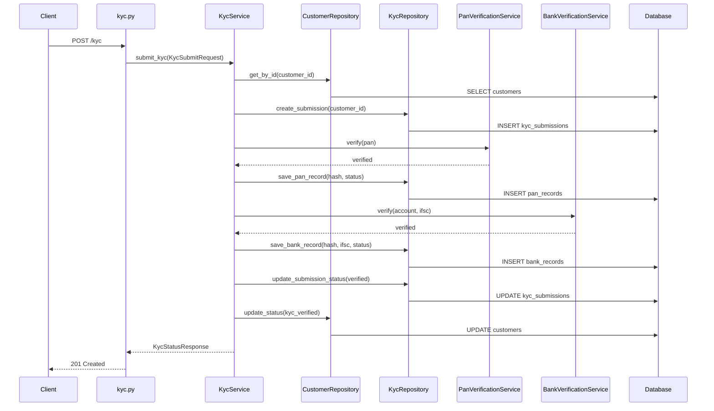

# Flow Trace — POST /kyc (Complete KYC Submission)

**Traced flow:** Customer KYC submission from HTTP entry to database persistence  
**Evidence:** `evidence/flow-traces/onboarding-api/flow-docs/post-kyc.md`, `sequence-diagrams/post-kyc.mmd`  
**Tracer implementation:** `engines/intelligence/src/intelligence/tracing/fastapi_tracer.py`

---

## Flow Steps

| Step | Layer | Component | File |
|:----:|-------|-----------|------|
| 1 | Entry | HTTP POST `/kyc` | `app/routers/kyc.py` |
| 2 | Validation | `KycSubmitRequest` (Pydantic) | `app/schemas/kyc.py` |
| 3 | Service | `KycService.submit_kyc` | `app/services/kyc_service.py:24` |
| 4 | Repository | `CustomerRepository.get_by_id` | `app/repositories/customer_repository.py` |
| 5 | Repository | `KycRepository.create_submission` | `app/repositories/kyc_repository.py` |
| 6 | External | `PanVerificationService.verify` (mock) | `app/services/pan_verification_service.py` |
| 7 | Repository | `KycRepository.save_pan_record` | `app/repositories/kyc_repository.py` |
| 8 | External | `BankVerificationService.verify` (mock) | `app/services/bank_verification_service.py` |
| 9 | Repository | `KycRepository.save_bank_record` | `app/repositories/kyc_repository.py` |
| 10 | Repository | `KycRepository.update_submission_status("verified")` | `app/repositories/kyc_repository.py` |
| 11 | Repository | `CustomerRepository.update_status("kyc_verified")` | `app/repositories/customer_repository.py` |
| 12 | Metrics | `KYC_SUBMISSIONS_TOTAL`, PAN/BANK counters | `app/core/metrics.py` |
| 13 | Response | `KycStatusResponse` | `app/schemas/kyc.py` |

**Workers / async consumers:** None (synchronous request thread)

**Side effects:**
- Inserts/updates rows in `kyc_submissions`, `pan_records`, `bank_records`, `customers`
- Increments Prometheus counters
- structlog events: `kyc_submitted`, `pan_verification_success`, `bank_verification_success`

---

## Mermaid Sequence Diagram



**Artifact:** `evidence/flow-traces/onboarding-api/sequence-diagrams/post-kyc.mmd`

---

## Test Evidence

Integration test executes this flow: `services/onboarding-api/tests/test_integration.py::test_full_kyc_onboarding_flow`

```bash
cd services/onboarding-api && PYTHONPATH=. .venv/bin/pytest tests/test_integration.py -v
```

---

## Uncertainty Notes

Spring Boot / Node repos: best-effort tracing only. See `evidence/api-maps/onboarding-api/uncertainty-report.md`.
