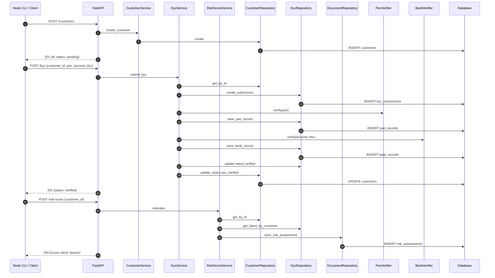

# Sequence Diagram — KYC Onboarding (Happy Path)

**Flow:** Create customer → Submit KYC → Calculate risk score  
**Evidence:** Integration test `tests/test_integration.py`, E2E `tests/e2e/test_platform_e2e.py`

---

## Full Pipeline Sequence



---

## Per-Endpoint Artifacts

| Endpoint | Sequence file |
|----------|---------------|
| POST /customers | `evidence/flow-traces/onboarding-api/sequence-diagrams/post-customers.mmd` |
| POST /kyc | `evidence/flow-traces/onboarding-api/sequence-diagrams/post-kyc.mmd` |
| POST /risk-score | `evidence/flow-traces/onboarding-api/sequence-diagrams/post-risk-score.mmd` |
| GET /health | `evidence/flow-traces/onboarding-api/sequence-diagrams/get-health.mmd` |
| _+ 5 more_ | `evidence/flow-traces/onboarding-api/sequence-diagrams/` |

---

## Verification

```bash
cd services/onboarding-api
PYTHONPATH=. .venv/bin/pytest tests/test_integration.py -v
PYTHONPATH=. .venv/bin/pytest ../../tests/e2e/test_platform_e2e.py -v
```

**Generated by:** `engines/intelligence/src/intelligence/tracing/sequence.py`
