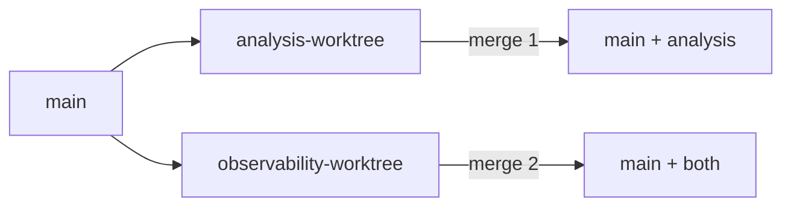

# Merge & Conflict Strategy

## Principles

1. **Path isolation** — assign directory ownership per stream to minimize conflicts.
2. **Merge order** — merge the smaller / upstream stream first; rebase long-lived branches before merge.
3. **No force-push to `main`** — use `--no-ff` merge commits to preserve worktree history.
4. **Clean up worktrees** after merge to avoid stale checkouts.

## Directory ownership

| Stream | Owned paths | Avoid editing in other streams |
|--------|-------------|--------------------------------|
| `analysis-worktree` | `engines/intelligence/`, `engines/rust-analyzer/`, `evidence/api-maps/`, `evidence/flow-traces/` | `infra/grafana/`, `app/core/metrics.py` |
| `observability-worktree` | `infra/prometheus/`, `infra/grafana/`, `docs/observability/`, `services/onboarding-api/app/core/metrics.py` | `engines/intelligence/src/` |
| `main` (integration) | `services/onboarding-api/` (API core), `clients/`, `tests/`, `docs/architecture/` | — |

Shared files (`README.md`, `Makefile`) — coordinate merges; expect occasional conflicts.

## Recommended merge order



1. Merge **`analysis-worktree`** into `main` first (intelligence features rarely touch metrics).
2. Merge **`observability-worktree`** second (may reference new API endpoints from analysis).
3. Run **`make test`** and **`make ci-local`** on integrated `main`.

```bash
git checkout main
git merge --no-ff analysis-worktree -m "merge: analysis-worktree into main"
git merge --no-ff observability-worktree -m "merge: observability-worktree into main"
make test
```

## Conflict resolution playbook

### Scenario A — same file, different sections (e.g. `README.md`)

```bash
git merge observability-worktree
# CONFLICT in README.md
```

**Resolution:** Keep both sections. Edit file to include analysis *and* observability status tables. Do not pick one side blindly.

```bash
git add README.md
git commit   # completes merge
```

### Scenario B — shared config (`Makefile`)

Both streams add targets. **Resolution:** Union of targets — include `worktree-demo`, `observability-verify`, `ci-local`, etc. Sort alphabetically within `.PHONY` groups.

### Scenario C — metrics + intelligence bridge

If `analysis-worktree` adds `rust_bridge` metrics and `observability-worktree` refactors `metrics.py`:

1. Finish observability refactor on its branch first.
2. Rebase `analysis-worktree` onto updated `main`.
3. Re-add bridge instrumentation on top of new metrics module.

```bash
git checkout analysis-worktree
git rebase main
# fix conflicts in app/core/metrics.py
git add app/core/metrics.py
git rebase --continue
```

### Scenario D — unresolvable overlap

Escalate to **sequential integration**: merge stream A, then cherry-pick commits from stream B that don't touch A's paths.

```bash
git cherry-pick <commit-sha>   # one commit at a time
```

## Worktree lifecycle

```bash
# Create
git worktree add .worktrees/analysis analysis-worktree
git worktree add .worktrees/observability observability-worktree

# List
git worktree list

# Remove after merge
git worktree remove .worktrees/analysis
git worktree remove .worktrees/observability
git branch -d analysis-worktree observability-worktree  # optional
```

## Verification after merge

| Check | Command |
|-------|---------|
| All tests | `make test` |
| CI simulation | `make ci-local` |
| Observability | `make observability-verify` |
| Intelligence CLI | `cd engines/intelligence && PYTHONPATH=src python -m intelligence.cli ../../services/onboarding-api -o /tmp/wt-check` |

## Risks

| Risk | Mitigation |
|------|------------|
| Stale worktree on old `main` | Rebase weekly; delete worktrees after merge |
| Duplicate `.venv` per worktree | One venv per worktree path, or shared via `PYTHONPATH` |
| Agent edits wrong worktree | Name worktree dirs explicitly; verify `git worktree list` before edits |
