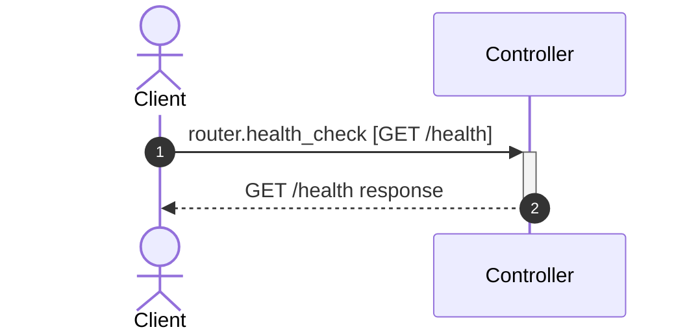

# Flow: GET /health

**Confidence:** 47%

## Request → Database Chain

1. **controller** → `router.health_check` (`app/routers/health.py:9`) — GET /health

## Sequence Diagram

## Uncertainties

- Service call not resolved in handler
