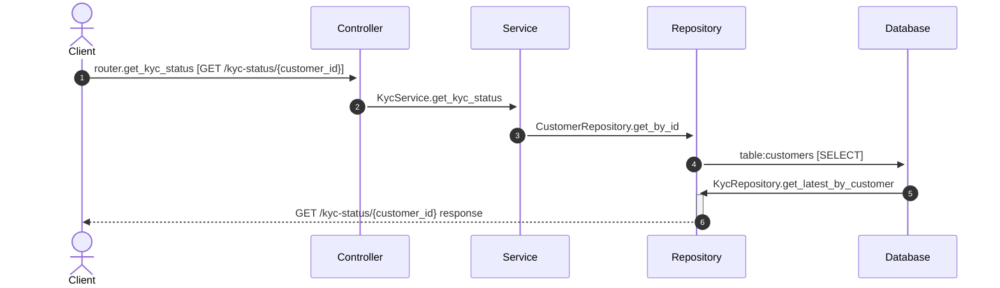

# Flow: GET /kyc-status/{customer_id}

**Confidence:** 84%

## Request → Database Chain

1. **controller** → `router.get_kyc_status` (`app/routers/kyc.py:18`) — GET /kyc-status/{customer_id}
2. **service** → `KycService.get_kyc_status` (`app/services/kyc_service.py:63`)
3. **repository** → `CustomerRepository.get_by_id` (`app/repositories/customer_repository.py:32`)
4. **database** → `table:customers` — SELECT
5. **repository** → `KycRepository.get_latest_by_customer` (`app/repositories/kyc_repository.py:32`)

## Sequence Diagram

## Uncertainties

- Could not resolve table for KycRepository.get_latest_by_customer
- Database table unresolved for KycRepository.get_latest_by_customer
