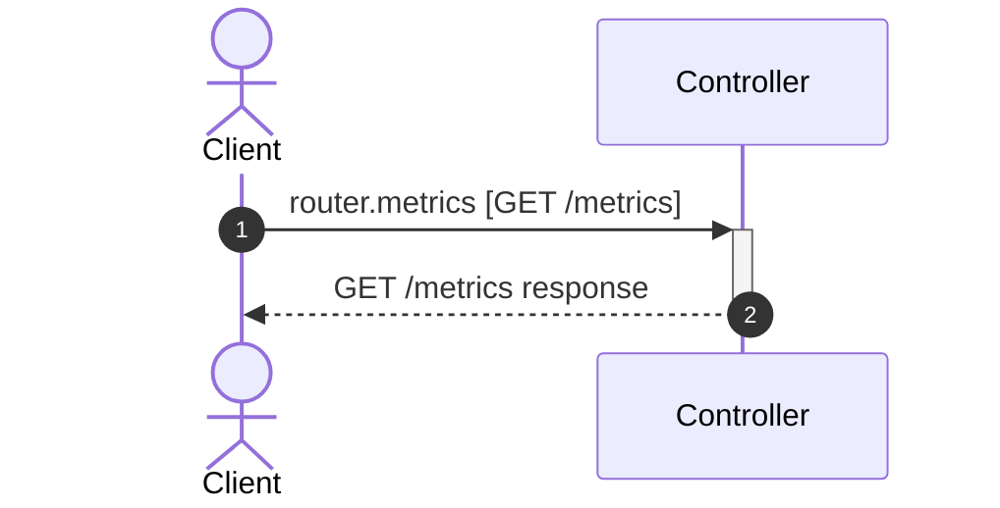

# Flow: GET /metrics

**Confidence:** 47%

## Request → Database Chain

1. **controller** → `router.metrics` (`app/routers/health.py:19`) — GET /metrics

## Sequence Diagram

## Uncertainties

- Service call not resolved in handler
