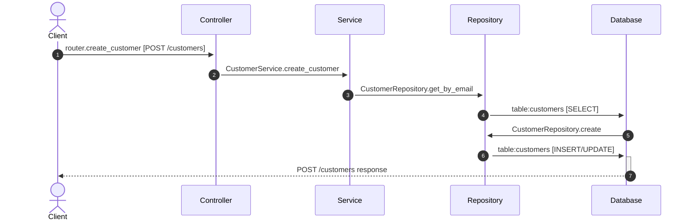

# Flow: POST /customers

**Confidence:** 92%

## Request → Database Chain

1. **controller** → `router.create_customer` (`app/routers/customers.py:11`) — POST /customers
2. **service** → `CustomerService.create_customer` (`app/services/customer_service.py:16`)
3. **repository** → `CustomerRepository.get_by_email` (`app/repositories/customer_repository.py:38`)
4. **database** → `table:customers` — SELECT
5. **repository** → `CustomerRepository.create` (`app/repositories/customer_repository.py:16`)
6. **database** → `table:customers` — INSERT/UPDATE

## Sequence Diagram

## Uncertainties

- Table inferred from method name `get_by_email`
