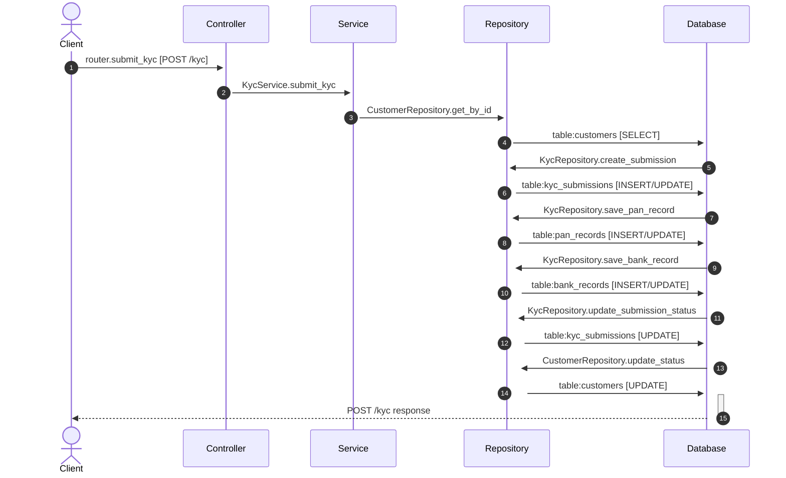

# Flow: POST /kyc

**Confidence:** 52%

## Request → Database Chain

1. **controller** → `router.submit_kyc` (`app/routers/kyc.py:13`) — POST /kyc
2. **service** → `KycService.submit_kyc` (`app/services/kyc_service.py:24`)
3. **repository** → `CustomerRepository.get_by_id` (`app/repositories/customer_repository.py:32`)
4. **database** → `table:customers` — SELECT
5. **repository** → `KycRepository.create_submission` (`app/repositories/kyc_repository.py:18`)
6. **database** → `table:kyc_submissions` — INSERT/UPDATE
7. **repository** → `KycRepository.save_pan_record` (`app/repositories/kyc_repository.py:51`)
8. **database** → `table:pan_records` — INSERT/UPDATE
9. **repository** → `KycRepository.save_bank_record` (`app/repositories/kyc_repository.py:69`)
10. **database** → `table:bank_records` — INSERT/UPDATE
11. **repository** → `KycRepository.update_submission_status` (`app/repositories/kyc_repository.py:89`)
12. **database** → `table:kyc_submissions` — UPDATE
13. **repository** → `CustomerRepository.update_status` (`app/repositories/customer_repository.py:42`)
14. **database** → `table:customers` — UPDATE

## Sequence Diagram

## Uncertainties

- Unknown repo attribute `_pan_service` on KycService
- Table inferred from method name `save_pan_record`
- Unknown repo attribute `_bank_service` on KycService
- Table inferred from method name `save_bank_record`
- Table inferred from method name `update_submission_status`
- Table inferred from method name `update_status`
