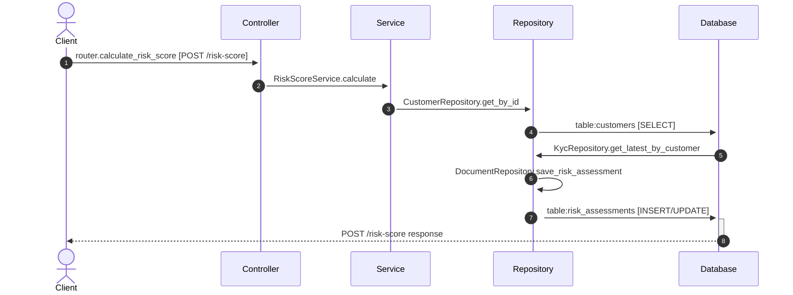

# Flow: POST /risk-score

**Confidence:** 76%

## Request → Database Chain

1. **controller** → `router.calculate_risk_score` (`app/routers/risk.py:11`) — POST /risk-score
2. **service** → `RiskScoreService.calculate` (`app/services/risk_score_service.py:34`)
3. **repository** → `CustomerRepository.get_by_id` (`app/repositories/customer_repository.py:32`)
4. **database** → `table:customers` — SELECT
5. **repository** → `KycRepository.get_latest_by_customer` (`app/repositories/kyc_repository.py:32`)
6. **repository** → `DocumentRepository.save_risk_assessment` (`app/repositories/document_repository.py:15`)
7. **database** → `table:risk_assessments` — INSERT/UPDATE

## Sequence Diagram

## Uncertainties

- Could not resolve table for KycRepository.get_latest_by_customer
- Database table unresolved for KycRepository.get_latest_by_customer
- Table inferred from method name `save_risk_assessment`
