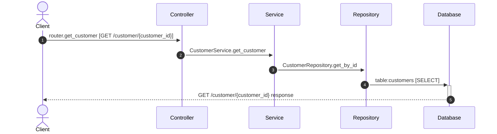

# Flow: GET /customer/{customer_id}

**Confidence:** 100%

## Request → Database Chain

1. **controller** → `router.get_customer` (`app/routers/customer_read.py:13`) — GET /customer/{customer_id}
2. **service** → `CustomerService.get_customer` (`app/services/customer_service.py:29`)
3. **repository** → `CustomerRepository.get_by_id` (`app/repositories/customer_repository.py:32`)
4. **database** → `table:customers` — SELECT

## Sequence Diagram

