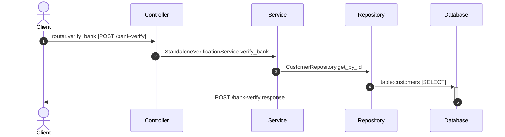

# Flow: POST /bank-verify

**Confidence:** 92%

## Request → Database Chain

1. **controller** → `router.verify_bank` (`app/routers/verification.py:21`) — POST /bank-verify
2. **service** → `StandaloneVerificationService.verify_bank` (`app/services/standalone_verification_service.py:31`)
3. **repository** → `CustomerRepository.get_by_id` (`app/repositories/customer_repository.py:32`)
4. **database** → `table:customers` — SELECT

## Sequence Diagram

## Uncertainties

- Unknown repo attribute `_bank_service` on StandaloneVerificationService
